---
prev:
  text: Deploy a Declarative Agent for Microsoft 365 Copilot
  link: /recruit/03-create-a-declarative-agent-for-M365Copilot
next:
  text: Using a Pre-Built Agent
  link: /recruit/05-using-prebuilt-agents
short-description: Package your agent into a reusable solution for environment management
difficulty: 1
codename: OPERATION CTRL-ALT-PACKAGE
time: 45
tags:
  - solutions
products:
  - copilot-studio
  - power-platform
industries:
  - it
created-date: 2025-08-20
last-edited-date: 2026-01-14
---
# 🚨 Mission 04: Creating a Solution for Your Agent {#mission-04-creating-a-solution-for-your-agent}

<mission-meta />

## 🎯 Mission Brief {#mission-brief}

**This is an optional mission to learn to about Solutions.**

Think of solutions creating a digital briefcase that holds your agent and it's artifacts.

## 🔎 Objectives {#objectives}

In this **optional** mission, you’ll learn:

1. Understanding what Power Platform solutions are and their role in agent development
1. Learning the benefits of using solutions for organizing and deploying agents
1. Exploring solution publishers and their importance in component management
1. Understanding the Power Platform solution lifecycle from development to production

> [!NOTE]
> This is an optional module aimed to give you background about solutions, which are used in wider-scale deployments. For the agents you will be building for yourself at Woodside, you do not need to worry about solutions. You can choose to skip this module if you prefer.

## 🕵🏻‍♀️ Solution? What's that? {#solution-whats-that}

In Microsoft Power Platform, solutions are like containers or packages that hold all the parts of your apps or agents - these could be tables, forms, flows, and custom logic. Solutions are essential for Application Lifecycle Management (ALM), they enable you to manage your app and agents from idea to development, testing, deployment, and updates.

In Copilot Studio, every agent you create is stored in a Power Platform solution. By default, agents are created in the Default solution, unless you create a new custom solution to create your agent in.

In Copilot Studio, there is the **Solution Explorer** where you can manage your solutions directly.

This means you can do the usual solution-related tasks:

- **Create a solution** - custom solutions enable agents to be exported and imported between environments.
- **Set your preferred solution** - choose the solution agents, apps, etc will be created in by default.
- **Add or remove components** - your agent could be referencing other components such as Agent Flows. Therefore these components needed to be included in the solution.
- **Export solutions** - to move solutions to another target environment.
- **Import solutions** - import solutions created elsewhere, including upgrading or updating solutions.

   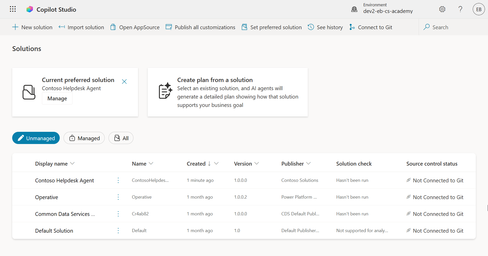

There are two types of solutions:

- **Unmanaged solutions** - used during development. You can freely edit and customize as needed.
- **Managed solutions** - used when you're ready to deploy your app to testing or production. These are locked down to prevent accidental changes.

## 🤔 Why _should_ I use a Solution for my agent? {#why-should-i-use-a-solution-for-my-agent}

Think of Solutions as a _toolbox_. When you need to fix or build something (an agent) in a different location (environment), you gather all the necessary tools (components) and put them in your toolbox (Solution). You can then carry this toolbox to the new location (environment) and use the tools (components) to complete your work, or add new tools (components) to customize your agent or project you're building.


Why solutions are valuable:

🧩 **Organized development**

- You're keeping your agent separate from everything  else in the environment. All your agent components are in one place 🎯

- Everything you need for your agent is in a solution, making it easier to export and import to a target environment 👉🏻 this is a healthy habit of ALM.

🧩 **Safe deployment**

- You can export your app or agent as a managed solution and deploy it to other target environments (such as testing or production) without risking accidental edits.

🧩 **Version control**

- You can create patches (target fixes), updates (a more comprehensive change) or upgrades (replacing a solution - usually major changes and introducing new features).

- Helps you roll out changes in a controlled way.

🧩 **Dependency management**

- Solutions track which parts depend on others. This prevents you from breaking things when you make changes.

🧩 **Team collaboration**

- Developers and makers can work together using unmanaged solutions in development, then hand off a managed solution for deployment.


## 🧭 Power Platform Solution lifecycle {#power-platform-solution-lifecycle}

So now you understand the purpose of a Solution, let's next learn about the lifecycle.

**1. Create Solution in Development environment** - start by creating a new solution in your Development environment.

**2. Add Components** - add apps, flows, tables, and other elements to your solution.

**3. Export as Managed solution** - package your solution for deployment by exporting it as a Managed solution.

**4. Import to Test environment** - test your solution in a separate Test environment to ensure everything works as expected.

**5. Import to Production environment** - deploy the tested solution to your live Production environment.

**6. Apply Patches, Updates or Upgrades** - make improvements or fixes using patches, updated, or upgrades. 🔁 Repeat the cycle!

> [!TIP]
> ✨ Example
>
> Imagine you're building an IT helpdesk agent to help employees with issues such as device problems, network troubleshooting, printer setup and more.
>
> - You start in a Development environment using an unmanaged solution.
>
> - Once it's ready, you export it as a managed solution and import it into a target environment such as a System Test or User Acceptance Testing (UAT) environment.
>
> - After testing, you move it to the Production environment - all without touching the original development version.

## 🧪 Lab 04: [OPTIONAL] Create a new Solution {#lab-04-create-a-new-solution}

> [!NOTE]
> THE FOLLOWING EXERCISE IS NOT REQUIRED FOR THE LABS. YOU MAY CHOOSE TO SKIP THIS.

We're now going to learn

- How to create a Solution publisher
- How to create a Solution


### Prerequisites

#### Security role

In Copilot Studio, what you _can do_ in the solution explorer depends on your user security role.
If you don’t have permission to manage solutions in the Power Apps admin center, you won’t be able to do those tasks in Copilot Studio either.


#### Developer environment


1. On the upper right, select the **Cog wheel** icon and switch from the default environment to your environment, for example **Adele Vance's environment**.

    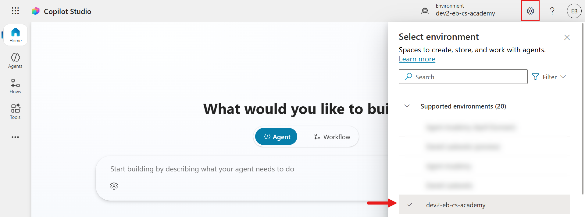

### 4.1 Create a Solution publisher

1. Using the same Copilot Studio environment used in the previous lesson, select the **ellipsis icon (. . .)** on the left hand side menu in Copilot Studio. Select **Solutions** under the **Explore** header.

    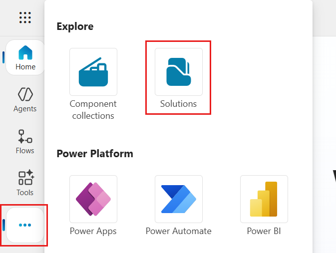

1. The **Solution Explorer** in Copilot Studio will load. Select **+ New solution**

    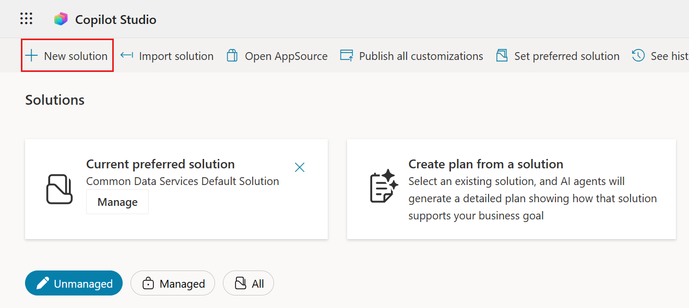

1. The **New solution** pane will appear where we can define the details of our solution. First, we need to create a new publisher. Select **+ New publisher**.

    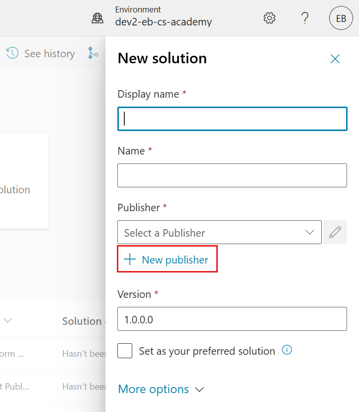  

1. The **Properties** tab of the **New publisher** pane will appear with required and non-required fields to be populated in the **Properties** tab. This is where we can outline the details of the publisher which will be used as the label or brand that identifies who created or owns the solution.

    |Property|Description|Required|
    |----------|----------|:----------:|
    |Display name|Display name for the publisher|Yes|
    |Name|The unique name and schema name for the publisher|Yes|
    |Description|Outlines the purpose of the solution|No|
    |Prefix|Publisher prefix which will be applied to newly created components|Yes|
    |Choice value prefix|Generates a number based on the publisher prefix. This number is used when you add options to choices and provides an indicator of which solution was used to add the option.|Yes|

    Copy and paste the following as the **Display name**,

    ```text
    Contoso Solutions
    ```

    Copy and paste the following as the **Name**,

    ```text
    ContosoSolutions
    ```

    Copy and paste the following as the **Description**,

    ```text
    Copilot Studio Agent Academy
    ```

    Copy and paste the following for the **Prefix**,

    ```text
    cts
    ```

    By default, the **Choice value** prefix will display an integer value. Update this integer value to the nearest thousand. For example, in my screenshot below, it was initially `77074`. Update this from `77074` to `77000`.

    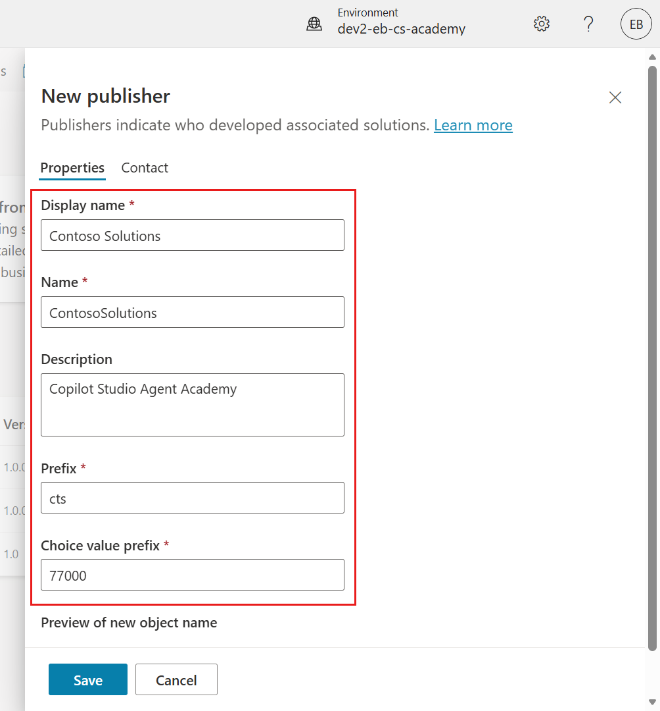  

1. If you want to provide the contact details for the Solution, select the **Contact** tab and populate the following columns displayed.

    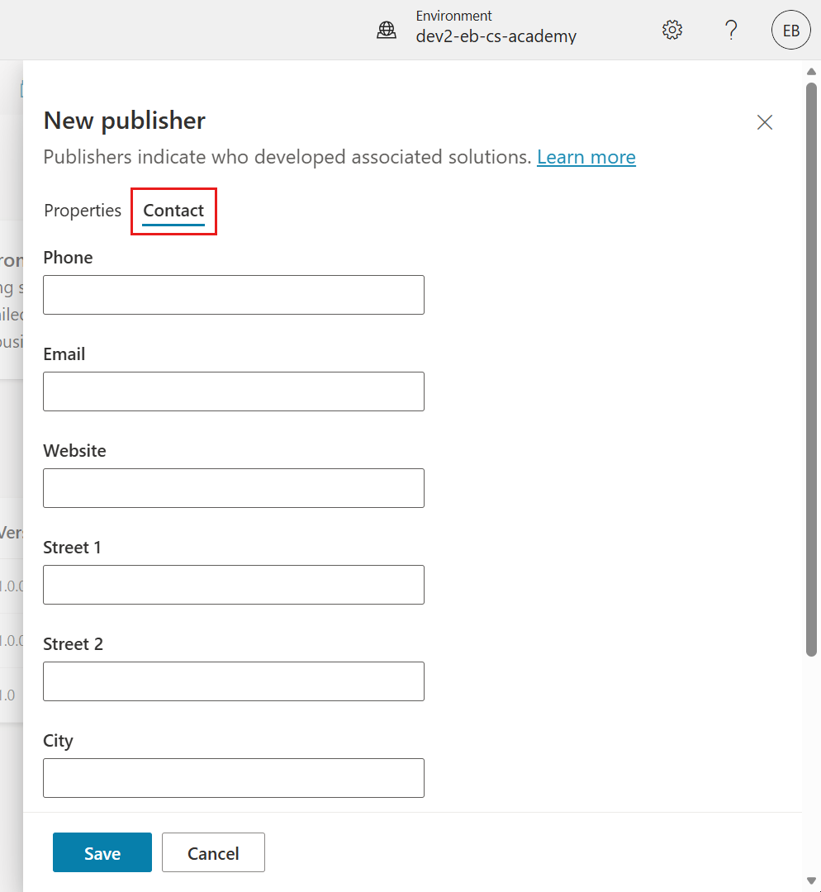

1. Select the **Properties** tab and select **Save** to create the Publisher.

    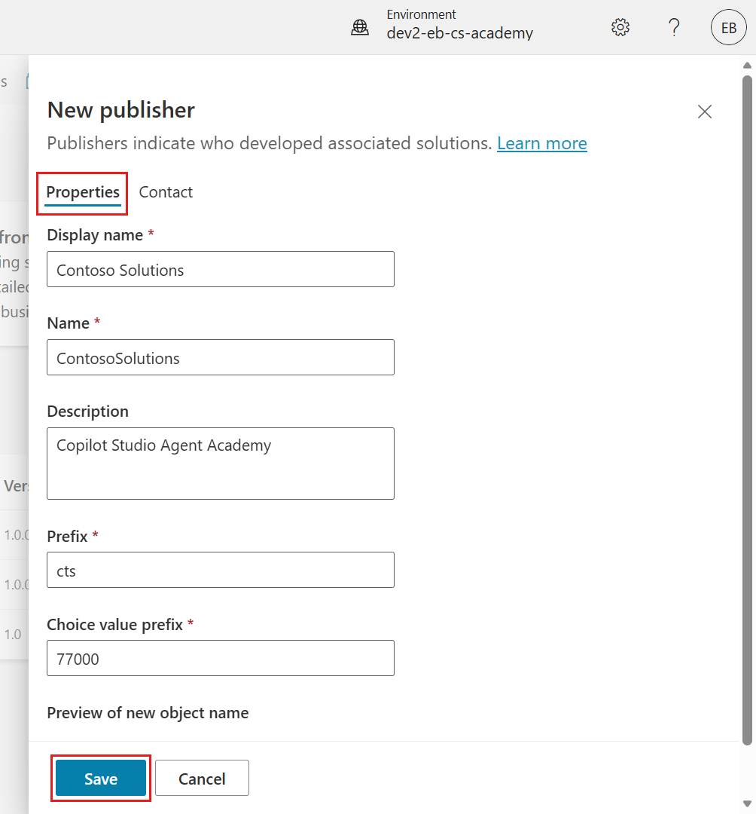

1. The New publisher pane will close and you'll be brought back to the **New solution** pane with the newly created Publisher selected.

    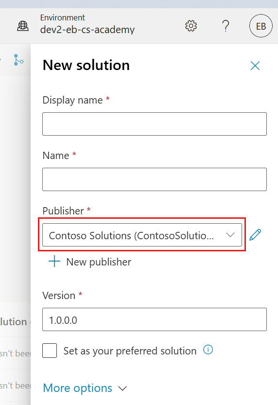  

High five, you've now created a Solution Publisher! 🙌🏻 We'll next learn how to create a new custom solution.

### 4.2 Create a new Solution

1. Now that we've created our solutions, we can now complete the rest of the form in the **New solution** pane.

    Copy and paste the following as the **Display name**,

    ```text
    Contoso Helpdesk Agent
    ```

    Copy and paste the following as the **Name**,

    ```text
    ContosoHelpdeskAgent
    ```

    Since we're creating a new solution, the [**Version** number](https://learn.microsoft.com/power-apps/maker/data-platform/update-solutions#understanding-version-numbers-for-updates/?WT.mc_id=power-172615-ebenitez) by default will be `1.0.0.0`.

    Tick the **Set as your preferred solution** checkbox.

    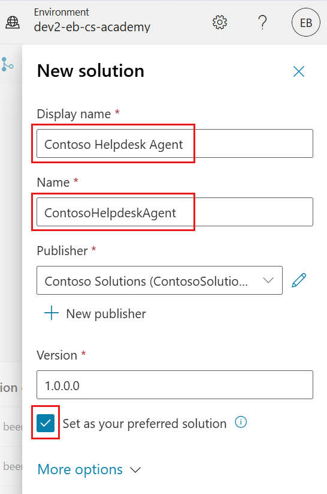  

1. Expand the **More options** to see additional details that can be provided in a solution.

    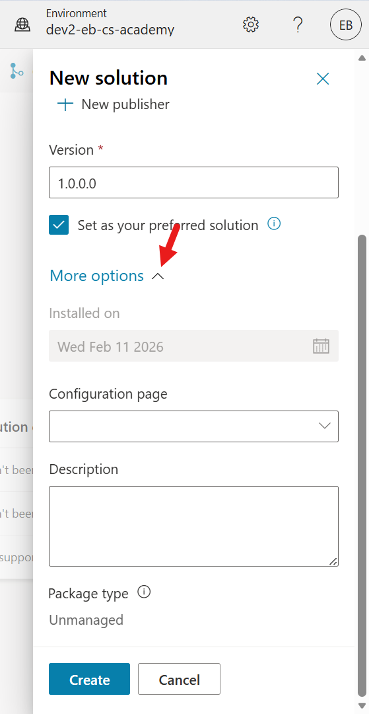

1. You'll see the following,

    - **Installed on** - the date of when the Solution was installed.

    - **Configuration page** - developers set up an HTML web resource to help users interact with their app, agent or tool where it'll appear as a web page in the Information section with instructions or buttons. It’s mostly used by companies or developers who build and share solutions with others.

    - **Description** - describes the solution or a high level description of the configuration page.

    We'll leave these blank for this lab.

    Select **Create**.

    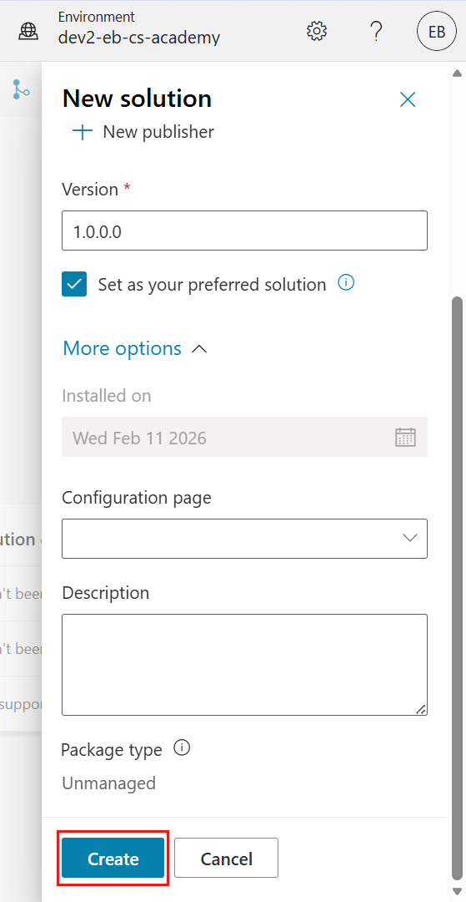

1. The solution for Contoso Helpdesk Agent has now been created. There will be zero components until we create an agent in Copilot Studio.

    Select the **back arrow** icon to return to the Solution Explorer.

    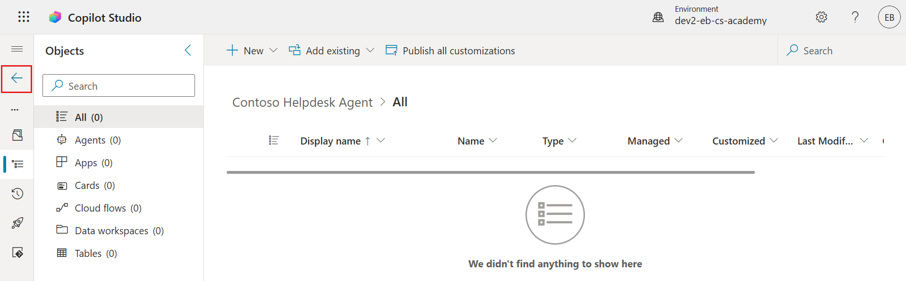

1. Notice how the Contoso Helpdesk Agent now displays as the **Current preferred solution** since we ticked the **Set as your preferred solution** checkbox earlier.

    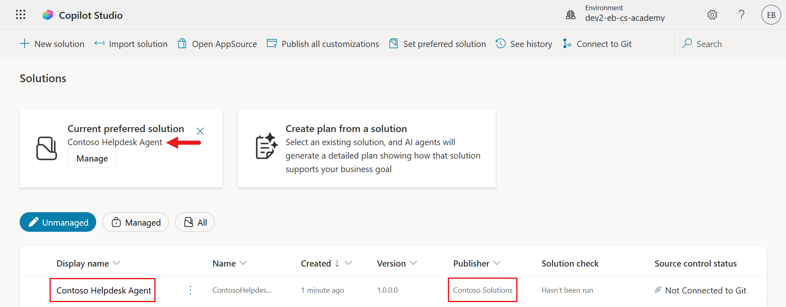

## ✅ Mission Complete {#mission-complete}

Congratulations! 👏🏻 You've created a Publisher and used it in your newly created Solution!

This is the end of **Lab 04 - Creating a Solution**, select the link below to move to the next lesson. 

⏭️ [Move to **Get started quickly with pre-built agents** lesson](../05-using-prebuilt-agents/index.md)

## 📚 Tactical Resources {#tactical-resources}

🔗 [Create a solution](https://learn.microsoft.com/power-apps/maker/data-platform/create-solution/?WT.mc_id=power-172615-ebenitez)

🔗 [Create and manage solutions in Copilot Studio](https://learn.microsoft.com/microsoft-copilot-studio/authoring-solutions-overview/?WT.mc_id=power-172615-ebenitez)

🔗 [Summary of resources available to predefined security roles](https://learn.microsoft.com/power-platform/admin/database-security#summary-of-resources-available-to-predefined-security-roles/?WT.mc_id=power-172615-ebenitez)

🔗 [Upgrade or update a solution](https://learn.microsoft.com/power-apps/maker/data-platform/update-solutions/?WT.mc_id=power-172615-ebenitez)

🔗 [Overview of pipelines in Power Platform](https://learn.microsoft.com/power-platform/alm/pipelines/?WT.mc_id=power-172615-ebenitez)

🔗 [Overview of Git integration in Power Platform](https://learn.microsoft.com/power-platform/alm/git-integration/overview/?WT.mc_id=power-172615-ebenitez)

<analytics-tag section="recruit" mission="04-creating-a-solution" />
