---
prev:
  text: Add Event Triggers
  link: /recruit/10-add-event-triggers
next:
  text: Course Completion
  link: /recruit/course-completion
short-description: Deploy your agent to Microsoft Teams and Microsoft 365 Copilot
difficulty: 1
codename: OPERATION PUBLISH PUBLISH PUBLISH
time: 30
tags:
  - publishing
products:
  - copilot-studio
  - microsoft-365
  - teams
industries:
  - it
created-date: 2025-08-20
last-edited-date: 2026-01-14
---
# 🚨 Mission 11: Publish Your Agent {#mission-11-publish-your-agent}

<mission-meta />

## 🎯 Mission Brief {#mission-brief}

Make your agent available to users in Microsoft Teams and Microsoft 365 Copilot.

## 🔎 Objectives {#objectives}

📖 This lesson covers:

1. Why it's important to publish your agent
1. What happens when you publish your agent
1. How to add a channel (Microsoft Teams & Microsoft 365 Copilot)
1. How to add the agent in Microsoft Teams
   

## 🚀 Publish an agent {#publish-an-agent}

Every time you work on an agent in Copilot Studio you might update it by adding knowledge or tools. When you're ready with all the changes, and you tested thoroughly, you're ready to publish it. Publishing ensures that the latest updates are live. When you update your agent with new tools, and you don't hit the publish button, it's not available yet.

Make sure to always hit the publish button when you want to push the updates to use in the agent.

## ⚙️ Configure channels {#configure-channels}

Channels determine where you can interact with your agent. After you publish your agent, you can make it available in Microsoft 365 Copilot and Microsoft Teams channels. Each channel may display your agent's content differently. Your agent will be available to you in Teams chats and within Microsoft 365 Copilot experiences ([Learn more](https://learn.microsoft.com/microsoft-copilot-studio/publication-add-bot-to-microsoft-teams))

To add a channel, navigate to the **Channels** tab in your agent and select the channel you want to configure. 

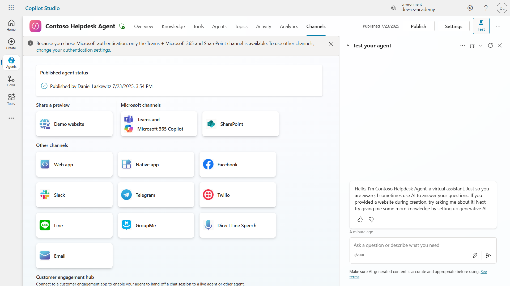

## 🧪 Lab 11: Publish your agent to Teams and Microsoft 365 Copilot {#lab-11-publish-your-agent-to-teams-and-microsoft-365-copilot}

### 🎯 Use case {#use-case}

Your Contoso IT Help Desk agent is now fully configured with powerful capabilities—it can access SharePoint knowledge sources, create support tickets, send proactive notifications, and respond intelligently to user queries. However, all these features are currently only available in the development environment where you built them.

**The Challenge:** End users can't benefit from your agent's capabilities until it's properly published and made accessible through the channels where they actually work.

**The Solution:** Publishing your agent ensures that the latest version—with all your recent updates, new topics, enhanced knowledge sources, and configured flows—is available to real users. Without publishing, users would still interact with an older version of your agent that might be missing critical functionality.

Adding the Teams and Microsoft 365 Copilot channel is equally crucial because:

- **Teams Integration**: Your organization's employees spend most of their day in Microsoft Teams for collaboration, meetings, and communication. By adding your agent to Teams, users can get IT support without leaving their primary work environment.

- **Microsoft 365 Copilot**: Users can access your specialized IT help desk agent directly within their Microsoft 365 Copilot experience, making it seamlessly integrated into their daily workflow across Office applications.

- **Centralized Access**: Instead of remembering separate websites or applications, users can access IT support through the platforms they're already using, reducing friction and increasing adoption.

This mission transforms your development work into a production-ready solution that delivers real value to your organization's end users.

### Prerequisites

Before starting this lab, ensure you have:

- ✅ Completed previous labs and have a fully configured Contoso Helpdesk Agent
- ✅ Your agent has been tested and is ready to use

### 11.1 Publish your agent

Now that all our work on the agent is done, we have to make sure all our work is available for the end users that are going to use our agent. To make sure the content is available for all users, we need to publish our agent.

1. Go to the Contoso Helpdesk Agent in Copilot Studio (via the [Copilot Studio maker portal](https://copilotstudio.microsoft.com))

    In Copilot Studio, it's easy to publish your agent. You can just select the publish button at the top of the agent overview.

    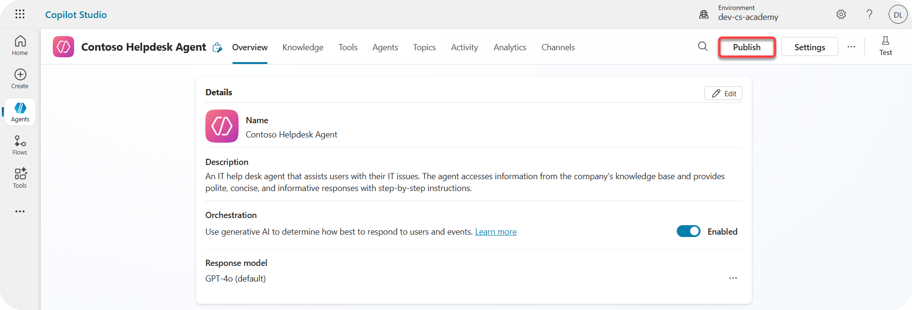

1. Select the **Publish** button in your agent

    It opens the publish pop-up - to confirm you really want to publish your agent.

    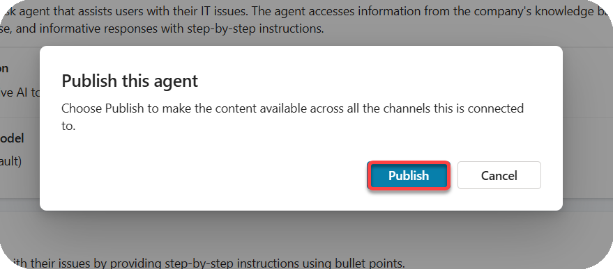

1. Select **Publish** to confirm publishing your agent

    Now a message shows that your agent is publishing. You don't have to keep that popup open. You get notified when the agent is published.

    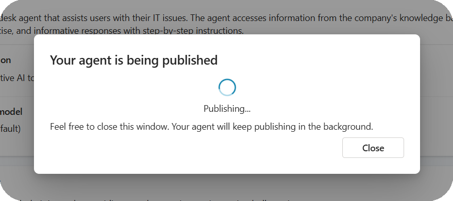

    When the agent is done publishing, you see the notification at the top of the agent page.

    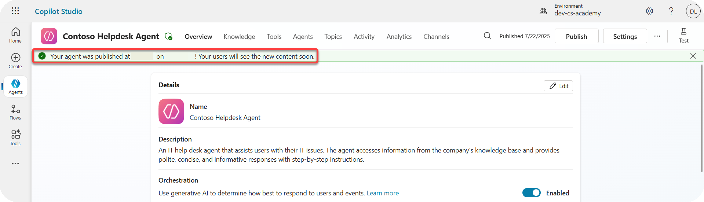

But - we only published the agent, we didn't add it to a channel yet, so lets fix that now!

### 11.2 Add the Teams and Microsoft 365 Copilot channel

1. To add the Teams and Microsoft 365 Copilot channel to our agent, we need to select **Channel** in the top navigation of the agent

    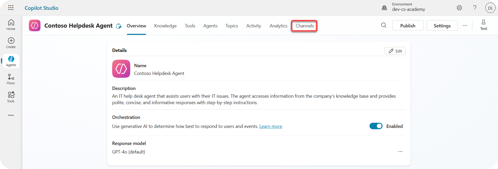

    Here we can see all the channels we can add to this agent.

1. Select **Teams and Microsoft 365**

    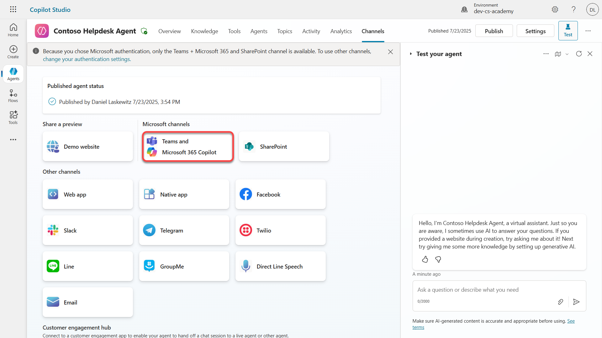

1. Select **Add channel** to complete the wizard and add the channel to the agent

    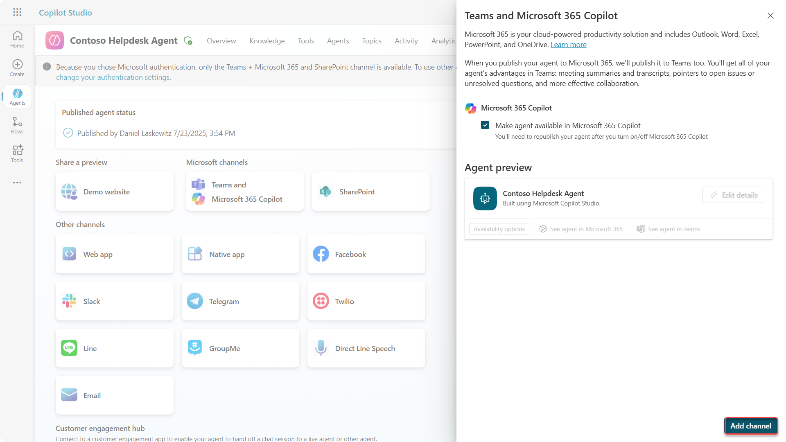

    It will take a little while until it's added. After it's added a green notification will appear on the top of the sidebar.

    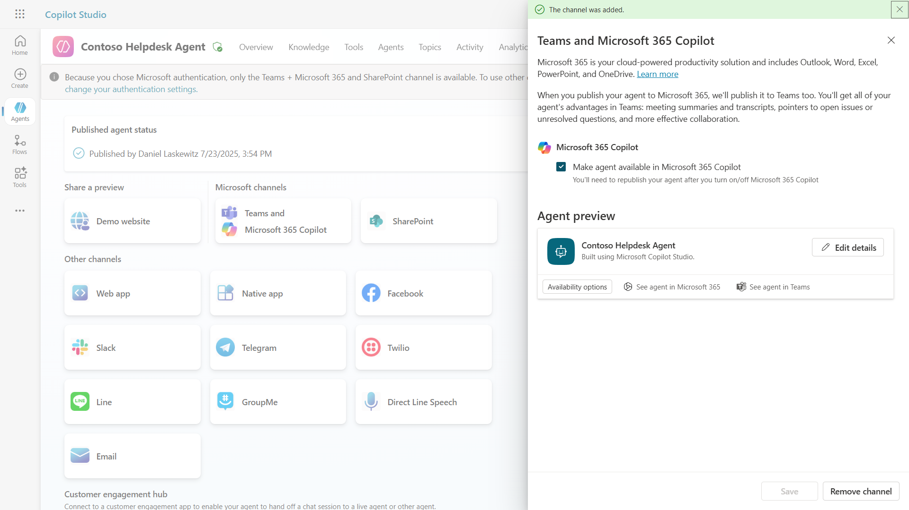

1. Select **See agent in Teams** to open a new tab

    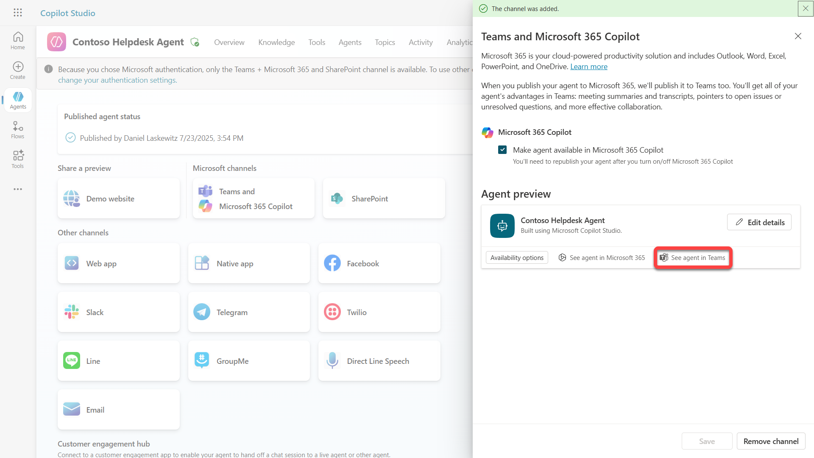

1. Select **Add** to add the Contoso Helpdesk Agent to Teams

    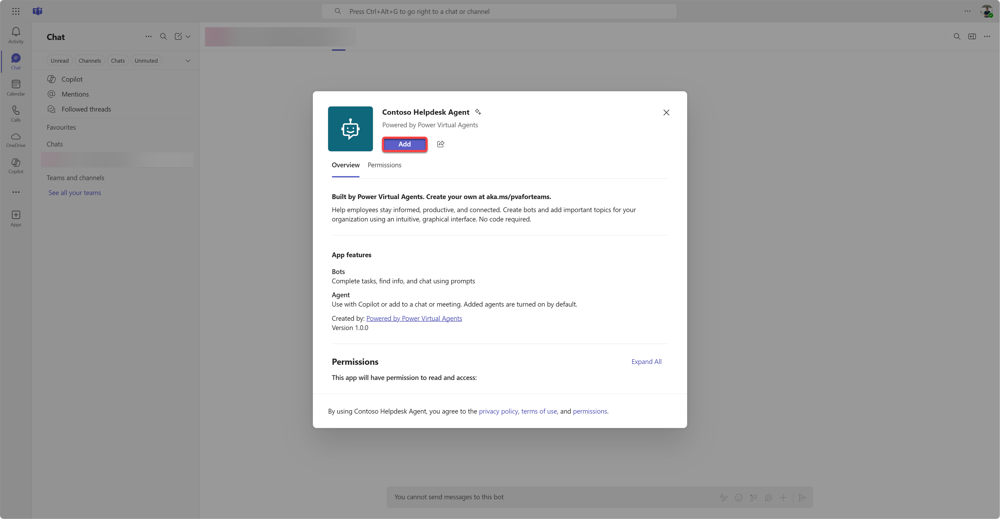

    This should take a little while. After it should show the following screen:

    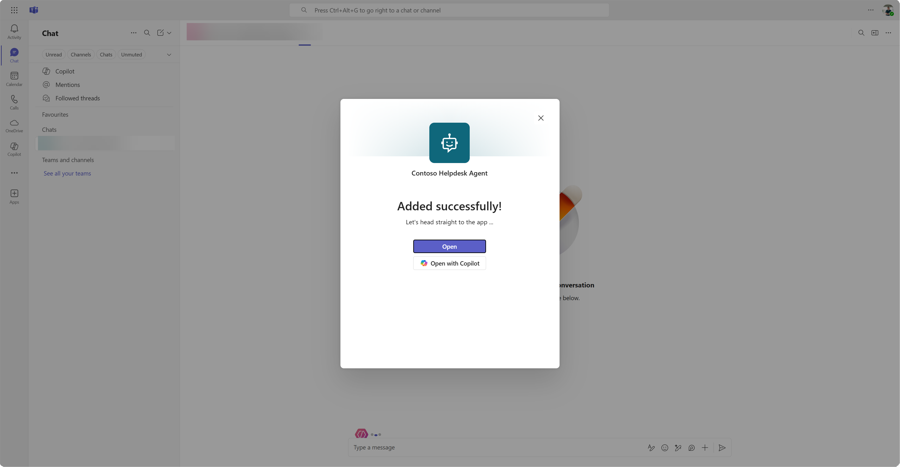

1. Select **Open** to open the agent in Teams. You can also choose to open the agent in Copilot.

    This will open the agent in Teams as a Teams app

    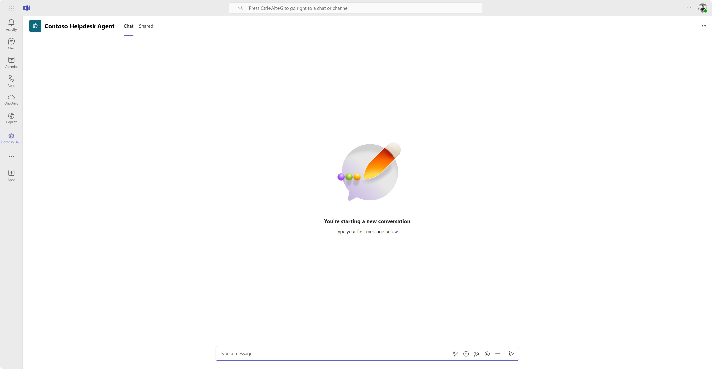

Now we have published the agent to work for you in Microsoft Teams.

> [!NOTE]
> At Woodside, your access to agents in Copilot Studio is set up for individual use, not sharing. Sharing is disabled.

## ✅ Mission Complete {#mission-complete}

🎉 **Congratulations!** You successfully published your agent and added it to Teams and Microsoft 365 Copilot!

## 📚 Tactical Resources {#tactical-resources}

🔗 [Publish channels documentation](https://learn.microsoft.com/microsoft-copilot-studio/publication-fundamentals-publish-channels)

<analytics-tag section="recruit" mission="11-publish-your-agent" />
