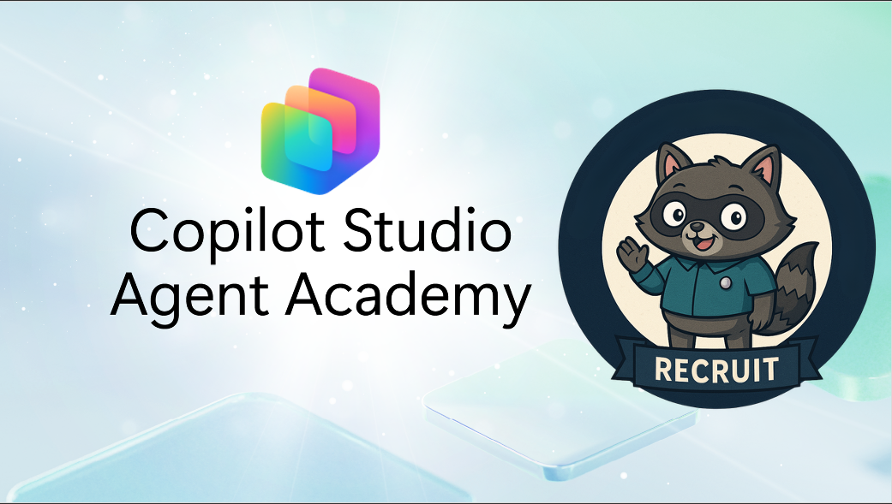

---
next:
  text: 'Course Setup'
  link: '/recruit/00-course-setup'
lastUpdated: false
---

# Welcome Recruit

**Welcome, Recruit.**  
Your mission—should you choose to accept it—is to master the art of building agents using **Microsoft Copilot Studio**.

This hands-on training is your entry point into the **world of agents**: from creating your first agent, connecting to knowledge and using agent flows, you'll learn how to build, scale, and deploy intelligent agents using real-world tools and use cases, within the Woodside environment provided to you.

## 🎯 Mission Objective {#mission-objective}

By completing the Agent Academy, you'll be able to:

- Understand what agents are in the context of Microsoft Copilot Studio
- Explore how Large Language Models (LLMs), retrieval-augmented generation (RAG), and orchestration come together in an agent
- Build both **declarative** and **custom agents**
- Enhance agents with **Topics**, **Adaptive Cards**, and **Agent Flows**
- Deploy agents to **Microsoft Teams** and **Microsoft 365 Copilot**

## 🧭 Curriculum Overview {#curriculum-overview}

This academy is broken into progressive lessons—each one designed as a field mission to level up your agent-building skills.

| Lesson | Title | Mission Briefing |
| ------ | ----- | ---------------- |
| `00` | 🧰 [Course Setup](./00-course-setup/index.md) | Set up your dev environment, Copilot Studio trial, and SharePoint site |
| `01` | 🧠 [Introduction to Agents](./01-introduction-to-agents/index.md) | Understand conversational AI concepts, LLMs, and autonomous vs. declarative agents |
| `02` | 🛠️ [Copilot Studio Fundamentals](./02-copilot-studio-fundamentals/index.md) | Learn the building blocks: knowledge, skills, autonomy |
| `03` | 👩‍💻 [Create a Declarative Agent](./03-create-a-declarative-agent-for-M365Copilot/index.md) | Add your own agent to the Microsoft 365 Copilot, grounded in a prompt |
| `04` | 🧩 [Creating a Solution](./04-creating-a-solution/index.md) | Package your agent into a reusable solution for environment management |
| `05` | 🚀 [Get Started with Pre-Built Agents](./05-using-prebuilt-agents/index.md) | Use and customize a template agent to accelerate setup |
| `06` | ✍️ [Build a Custom Agent](./06-create-agent-from-conversation/index.md) | Create a new agent grounded in knowledge sources |
| `07` | 🧠 [Add a Topic with Triggers](./07-add-new-topic-with-trigger/index.md) | Use Topics to define custom question/answer paths |
| `08` | 🪪 [Enhance with Adaptive Cards](./08-add-adaptive-card/index.md) | Build an Adaptive Card using Power Fx and SharePoint |
| `09` | 🔁 [Automate with Agent Flows](./09-add-an-agent-flow/index.md) | Use Adaptive Card input to trigger back-end flows |
| `10` | 🧭 [Add Event Triggers](./10-add-event-triggers/index.md) | Enable your agent to act autonomously using event-based logic |
| `11` | 📢 [Publish Your Agent](./11-publish-your-agent/index.md) | Deploy your agent to Microsoft Teams and Microsoft 365 Copilot |
| `12` | 🚨 [Proof of Completion](./course-completion/index.md) | Take the quiz and register your training as complete |

<analytics-tag section="recruit" />
