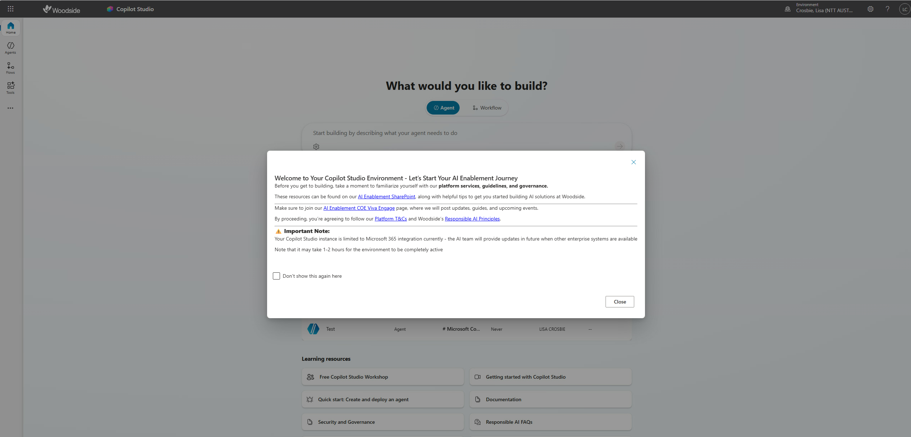
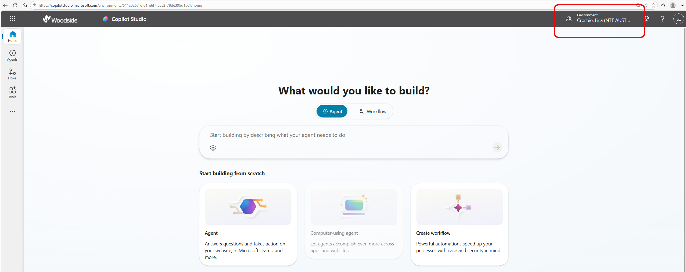

---
prev:
  text: Recruit overview
  link: /recruit
next:
  text: Introduction to Agents
  link: ./01-introduction-to-agents
short-description: 'Set up your dev environment, Copilot Studio trial, and SharePoint site'
difficulty: 1
codename: OPERATION DEPLOYMENT READY
time: 30
tags:
  - setup
products:
  - copilot-studio
  - sharepoint
  - microsoft-365
industries:
  - it
created-date: 2025-08-20
last-edited-date: 2026-03-16
---

# 🚨 Mission 00: Welcome and Log In {#mission-00-course-setup}

<mission-meta />

## 🎯 Mission Brief {#mission-brief}

Welcome to the first mission of your training as a Copilot Studio Agent.  
Before you can start building your first AI agent, you need to log in and understand your Copilot Studio developer environment. 
Before you can start building your first AI agent, you need to log in and understand your Copilot Studio developer environment. **field-ready development environment**.

This briefing outlines how to get started with Copilot Studio, logging in, selecting your environment, and understanding how to access preview features.

## 🔎 Objectives {#objectives}

Your mission includes:

1. Logging in to Copilot Studio with your Woodside account  
1. Selecting your developer environment as your Copilot Studio environment to build in  
1. Understanding preview features and how to access them

## 🧪 Copilot Studio Log In and Developer Environment (Steps 1–2) {#trial-environment-setup-steps-14}

## Step 1: Log in with your Woodside account

You will sign in to Copilot Studio using a web browser:

**Navigate to Copilot Studio**  
   1. Go to the [Copilot Studio homepage](https://www.copilotstudio.microsoft.com)
   1. When prompted, sign in with your Woodside account
   1. If prompted, select your country/region
   1. You will be greeted with a welcome message. Read the terms and conditions and check the "Don't show this again here" checkbox. Then select Close. 

      

## Step 2: Your developer environment

When you build agents in Copilot Studio, you will always work in your own personal developer environment. This environment has been set up to give you access to the connectors and knowledge you are allowed to use safely within the Woodside environment. When you log in, you will automatically start in your developer environment. You should always build your agents here. Do not change this setting or use the "Community" or any other environment. 

When you log in, you will see the environment at the top right. This environment is in your name. Always work here - do not change this.  

## Understanding preview features

To follow the training here, you should use the main Copilot Studio homepage as described in the previous steps. The following is provided for information only. 

If you wish, you can choose to explore upcoming, or preview features. When you log in to the main Copilot Studio site as described above, you are using features that are all generally available. You can also access preview features (new features that are still in final testing or development by Microsoft before they become generally available). Preview features will give you access to some of the newer, cutting edge AI technologies, and upcoming changes to the user experience. This is great for experimentation but note that these features are not fully supported, they may not work properly, and they are subject to change, until they become generally available. 

Access preview features by navigating to [Copilot Studio Preview](https://copilotstudio.preview.microsoft.com).

    - Log in with your Woodside account
    - Select "Skip" to close the welcome message, or "Next" to navigate through it.
    - Now you can build agents using preview features

  

## ✅ Mission Complete {#mission-complete}

You’ve successfully:

- Logged in to your Copilot Studio account  
- Started in your personal developer environment 
- Learned how to access preview features
