---
prev:
  text: Add an agent flow to your Topic for automation
  link: ../09-add-an-agent-flow/
next:
  text: Publish your agent
  link: ../11-publish-your-agent/
short-description: Enable your agent to act autonomously using event-based logic
difficulty: 1
codename: OPERATION GHOST ROUTINE
time: 45
tags:
  - automation
  - triggers
products: [copilot-studio, power-automate, outlook, sharepoint, power-platform]
industries:
  - it
created-date: 2025-08-20
last-edited-date: 2026-02-19
---
# 🚨 Mission 10: Add Event Triggers - Enable autonomous agent capabilities {#mission-10-add-event-triggers-enable-autonomous-agent-capabilities}

<mission-meta />

## 🎯 Mission Brief {#mission-brief}

It is now time to extend your agent beyond conversation and enable it to respond automatically to defined events. You will learn how to use Event Triggers so your agent can monitor approved Microsoft 365 sources and take action when a relevant signal is received. This allows the agent to support business processes in a more proactive and efficient way.

## 🔎 Objectives {#objectives}

📖 This lesson will cover:

- Understanding Event Triggers and how they enable autonomous agent behavior
- Learning the difference between event triggers and topic triggers, including trigger workflows and payloads
- Exploring common Event Trigger scenarios
- Building an autonomous IT Help Desk agent that responds to SharePoint events and sends email acknowledgments

## 🤔 What is an Event Trigger? {#what-is-an-event-trigger}

An **Event Trigger** is a mechanism that allows your agent to act autonomously in response to external events, without requiring direct user input. Think of it as making your agent "watch" for specific events and automatically take action when those events occur.

Unlike topic triggers, which require users to type something to activate a conversation, event triggers activate based on things happening in your connected systems. E.g.:

- When a new file is created in SharePoint or OneDrive for Business
- When a task is completed in Planner
- When a new Microsoft Form response is submitted
- When a new Microsoft Teams message is added
- Based on a recurring schedule (like daily reminders)  
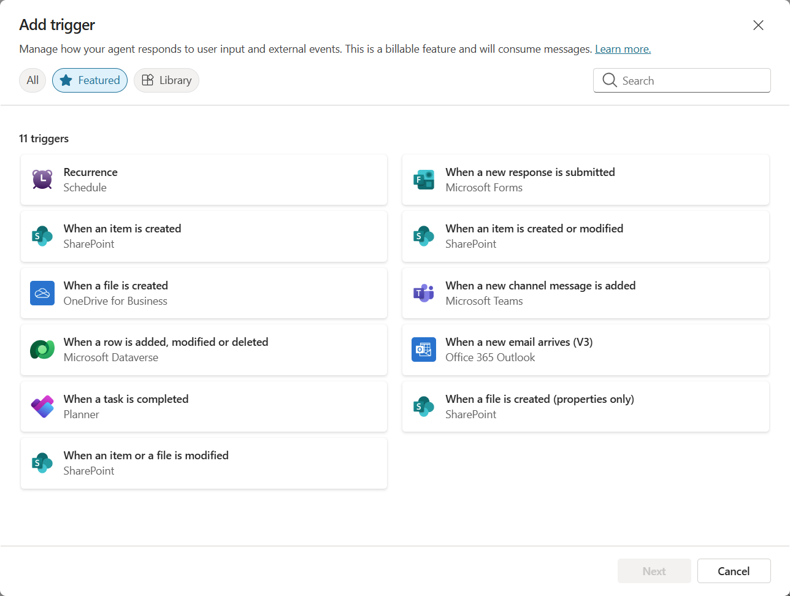

### Why Event Triggers matter in autonomous agents

Event triggers transform your agent from a reactive assistant into a proactive, autonomous helper:

1. **Autonomous operation** - your agent can work 24/7 without human intervention, responding to events as they happen.
    - *Example:* Automatically welcome new team members when they're added to a team.

1. **Real-time responsiveness** - instead of waiting for users to ask questions, your agent responds immediately to relevant events.
    - *Example*: Alert the IT team when a SharePoint document is modified.

1. **Workflow automation** - chain together multiple actions based on a single trigger event.
    - *Example:* When a new support ticket is created, create a task, notify the manager, and update the tracking dashboard.

1. **Consistent processes** - ensure important steps never get missed by automating responses to key events.
    - *Example:* Every new employee automatically gets onboarding materials and access requests.

1. **Data-driven actions** - use information from the triggering event to make smart decisions and take appropriate actions.
    - *Example:* Route urgent tickets to senior staff based on priority level in the trigger payload.

## ⚙️ How do Event Triggers work? {#how-do-event-triggers-work}

Event triggers operate through a three-step workflow that enables your agent to respond autonomously to external events:

### The trigger workflow

1. **Event Detection** - A specific event occurs in a connected system (SharePoint, Teams, Outlook, etc.)
1. **Trigger Activation** - The event trigger detects this event and sends a payload to your agent via a Power Automate Cloud Flow.
1. **Agent Response** - Your agent receives the payload and executes the instructions you've defined

### Event vs Topic triggers

Understanding the difference between these two trigger types is crucial:

| **Event Triggers** | **Topic Triggers** |
| -------------------- | -------------------- |
| Activated by external system events | Activated by user input/phrases |
| Enable autonomous agent behavior | Enable conversational responses |
| Use maker's authentication | Option for user's authentication |
| Run without user interaction | Require user to start conversation |
| Examples: File created, email received | Example: "What's the weather?" |

## 📦 Understanding trigger payloads {#understanding-trigger-payloads}

When an event occurs, the trigger sends a **payload** to your agent containing information about the event and instructions on how to respond.

### Default vs custom payloads

Every trigger type comes with a default payload structure, but you can customize it:

**Default payload** - Uses the standard format like `Use content from {Body}`

- Contains basic event information
- Uses generic processing instructions
- Good for simple scenarios

**Custom payload** - Add specific instructions and data formatting

- Include detailed directions for your agent
- Specify exactly what data to use and how
- Better for complex workflows

### Agent instructions vs custom payload instructions

You have two places to guide your agent's behavior with event triggers:

**Agent Instructions** (Global)

- Broad guidance that applies to all triggers
- Example: "When processing tickets, always check for duplicates first"
- Best for general behavior patterns

**Payload Instructions** (Trigger-specific)

- Specific directions for individual trigger types  
- Example: "For this SharePoint update, send a summary to the project channel"
- Best for complex agents with multiple triggers

💡 **Pro tip**: Avoid conflicting instructions between these two levels, as this can cause unexpected behavior.

## 🎯 Common Event Trigger scenarios {#common-event-trigger-scenarios}

Here are practical examples of how event triggers can enhance your agent:

### IT Help Desk Agent

- **Trigger**: New SharePoint list item (support ticket)
- **Action**: Automatically categorize, assign priority, and notify appropriate team members

### Employee Onboarding Agent

- **Trigger**: New onboarding request added to a SharePoint list
- **Action**: Send a welcome email, update the onboarding tracker in SharePoint, and notify the relevant contact by email.

### Project Management Agent

- **Trigger**: Task completed in Microsoft Planner
- **Action**: Update project dashboard, notify stakeholders, and check for blockers

### Document Management Agent

- **Trigger**: File uploaded to specific SharePoint folder
- **Action**: Extract metadata, apply tags, and notify document owners

### Meeting Assistant Agent

- **Trigger**: Calendar event created
- **Action**: Send pre-meeting reminders and agenda, book resources

## ⚠️ Publishing and authentication considerations {#publishing-and-authentication-considerations}

Before your agent can use event triggers in production, you need to understand authentication and security implications.

### Maker authentication

Event triggers use the **agent creator's credentials** for all authentication:

- Your agent accesses systems using your permissions
- Users can potentially access data through your credentials
- All actions are performed "as you" even when users interact with the agent

### Data protection best practices

To maintain security when publishing agents with event triggers:

1. **Evaluate data access** - Review what systems and data your triggers can access
1. **Test thoroughly** - Understand what information triggers include in payloads
1. **Narrow trigger scope** - Use specific parameters to limit what events activate triggers
1. **Review payload data** - Ensure triggers don't expose sensitive information
1. **Monitor usage** - Track trigger activity and resource consumption

## ⚠️ Troubleshooting and limitations {#troubleshooting-and-limitations}

Keep these important considerations in mind when working with event triggers:

### Quota and billing impacts

- Each trigger activation counts toward your message consumption
- Frequent triggers (like every-minute recurrence) can quickly consume quota
- Monitor usage to avoid throttling

### Technical requirements

- Only available for agents with generative orchestration enabled
- Requires solution-aware cloud flow sharing to be enabled in your environment

### Data Loss Prevention (DLP)

- Woodside's DLP policies determine which triggers are available
- Administrators can block event triggers entirely

## 🧪 Lab 10 - Add Event Triggers for autonomous agent behavior {#lab-10-add-event-triggers-for-autonomous-agent-behavior}

### 🎯 Use case {#use-case}

You'll enhance your IT Help Desk agent to automatically respond to new support requests. When someone creates a new item in your SharePoint support tickets list, your agent will:

1. Trigger autonomously when the SharePoint ticket is created
1. Provide the ticket details and instructions on the steps that you want it to perform
1. Automatically acknowledge the ticket via an AI generated email

This lab demonstrates how event triggers enable truly autonomous agent behavior.

### Prerequisites

Before starting this lab, ensure you have:

- ✅ Completed previous labs (especially Lab 6-8 for the IT Help Desk agent)
- ✅ Access to the SharePoint site with the IT support tickets list, [Agent Academy Training Site](https://woodsideenergy.sharepoint.com/sites/AgentAcademyTrainingSite) 
- ✅ Copilot Studio environment with event triggers enabled
- ✅ Your agent has generative orchestration enabled
- ✅ Appropriate permissions in SharePoint and your Copilot Studio environment

> [!WARNING]
> This SharePoint list is a fictional IT support tickets list, which contains demo data used for these exercises. This is a shared list used by everyone at Woodside who is completing this training. You will see rows created by other users, and any rows you create will be visible to others who are completing the training (unless you delete your rows when you have finished). This data is only for training purposes and is not used for anything real at Woodside. Screenshots show the list called 'Tickets'. Your list is called 'Tickets-TrainingContent' so that it is clear this is not a real list for Woodside.

### 10.1 Enable Generative AI and create a SharePoint item creation trigger

1. Open your **Contoso Helpdesk agent** in **Copilot Studio**

1. First, ensure **Generative AI** is enabled for your agent:
   - Select **Settings**
   - Under the **Orchestration** section, select **Yes** under **Use generative AI orchestration for your agent's responses?** if it's not already enabled  
     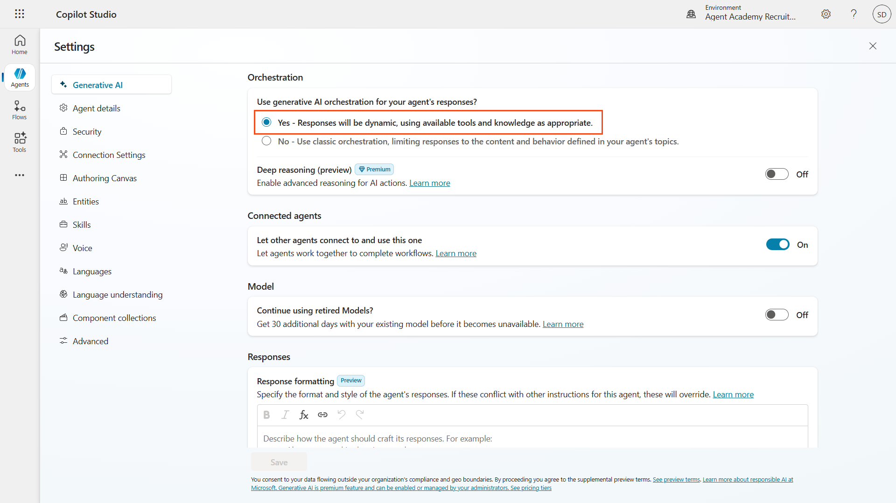

1. Select **Save** if required, or close **Settings** if no changes were needed

1. Navigate to the **Overview** tab and locate the **Triggers-TrainingContent** section

1. Click **+ Add trigger** to open the trigger library  
    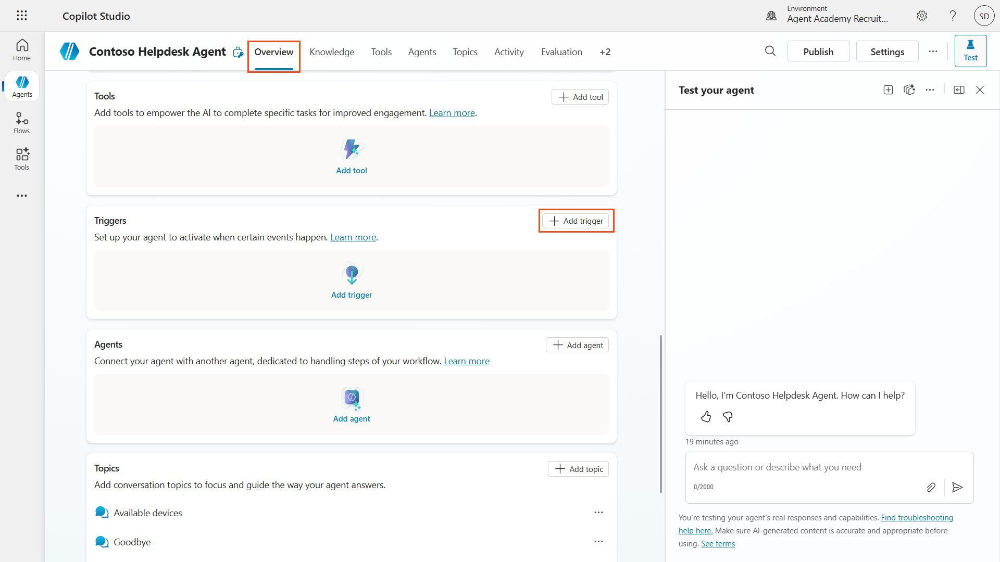

1. Search for and select **When an item is created** (SharePoint)  
    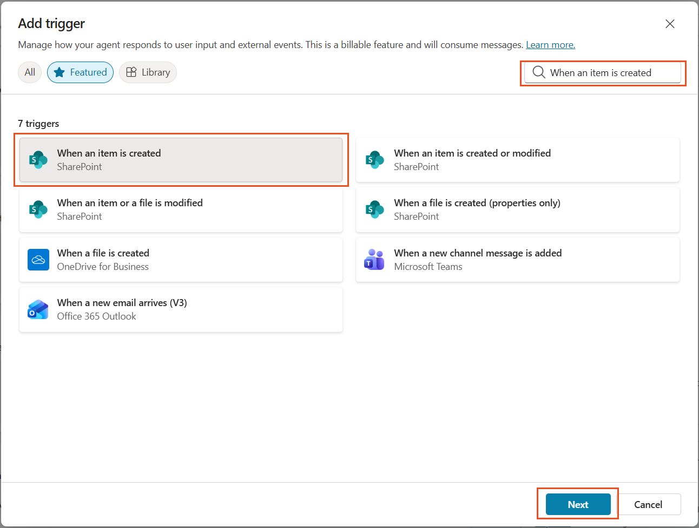

1. Configure the trigger name and connections:

   - **Trigger name:** New Support Ticket Created in SharePoint

1. Wait for the connections to configure, and select **Next** to proceed.  
   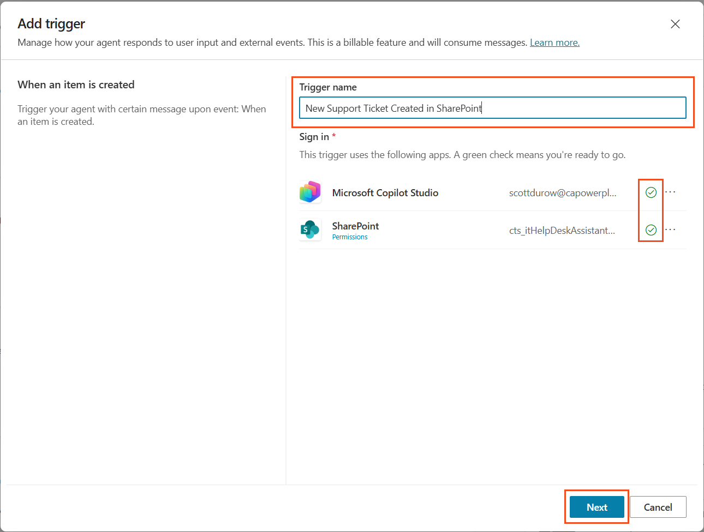

1. Configure the trigger parameters:

   - **Site Address**: Select your "Agent Academy Training" SharePoint site

   - **List Name**: Choose your "Tickets-TrainingContent" list

   - **Limit Columns by view (Optional)**: Leave this as `Select an Item`

   - **Additional instructions to the agent when it's invoked by the trigger:**

     ```text
     New Support Ticket Created in SharePoint: {Body}
     
     Use the 'Acknowledge SharePoint Ticket' tool to generate the email body automatically and respond.
     
     IMPORTANT: Do not wait for any user input. Work completely autonomously.
     ```

     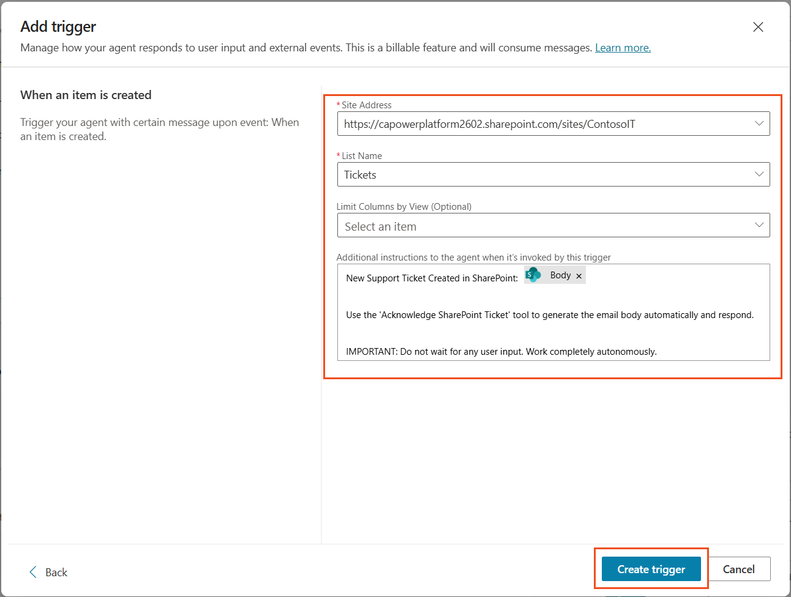
     
    > [!NOTE]
    > Screenshots will show the SharePoint site name as Contoso IT. Your SharePoint site is named Agent Academy Training.
1. Select **Create trigger** to complete the trigger creation. A Power Automate Cloud Flow is automatically created to trigger the agent autonomously.

1. Select **Close**.

### 10.2 Edit the Trigger

1. Inside the **Triggers** section of the **Overview** tab, Select the **...** menu on the **New Support Ticket Created in SharePoint** trigger

1. Select **Edit in Power Automate**  
   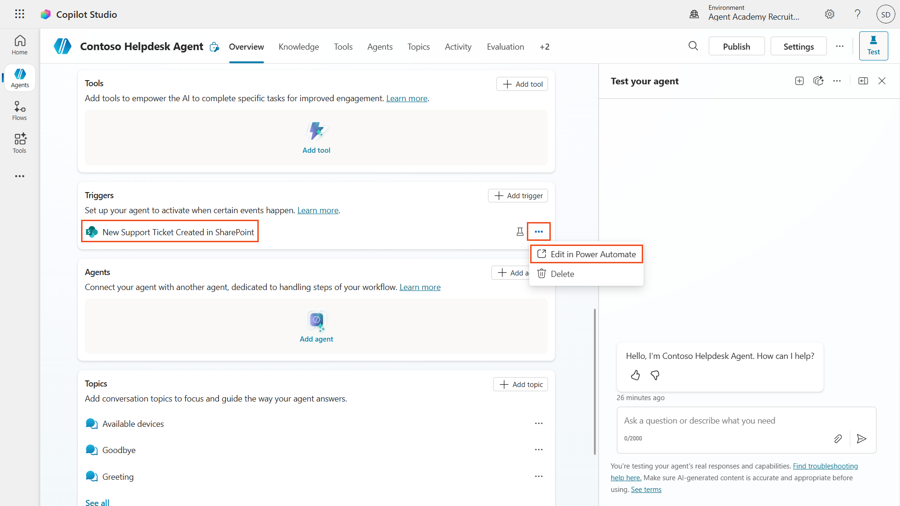

1. Ensure you have the **New designer** toggle selected

1. Select the **Sends a prompt to the specified copilot for processing** node

1. In the **Body/message** field, remove the Body content, **press the forward slash key** (/) and select **Insert Expression**  
   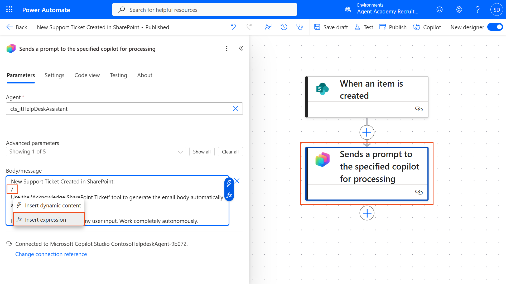

1. Enter the following expression to provide the agent with specific details about the ticket:

    ```text
    concat('Submitted By Name: ', first(triggerOutputs()?['body/value'])?['Author/DisplayName'], '\nSubmitted By Email: ', first(triggerOutputs()?['body/value'])?['Author/Email'], '\nTitle: ', first(triggerOutputs()?['body/value'])?['Title'], '\nIssue Description: ', first(triggerOutputs()?['body/value'])?['Description'], '\nPriority: ', first(triggerOutputs()?['body/value'])?['Priority/Value'],'\nTicket ID : ', first(triggerOutputs()?['body/value'])?['ID'])
    ```

1. Select **Add**  
   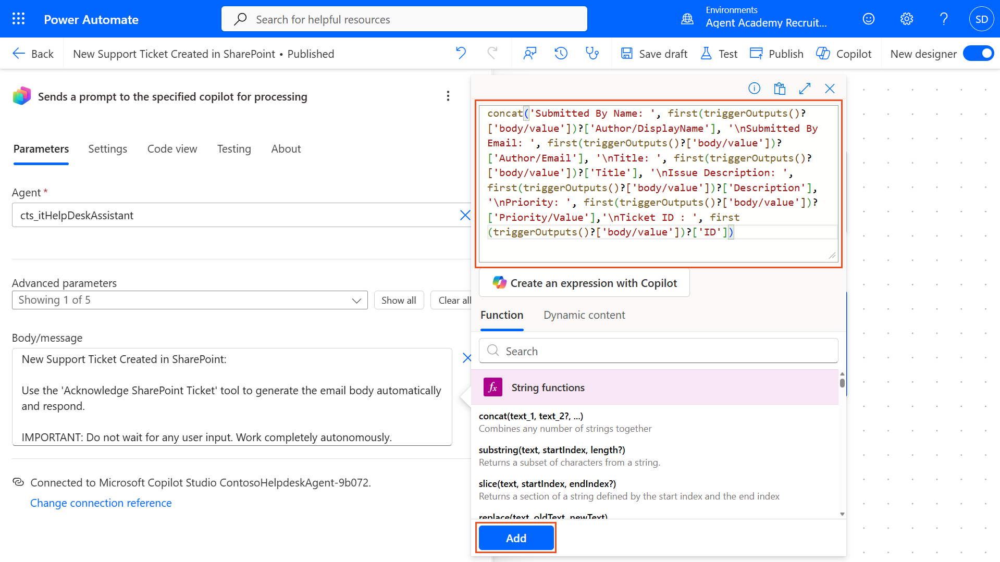

1. Select **Publish** on the top right toolbar.

### 10.3 Create a tool for email acknowledgment

1. **Return** to your Agent in Copilot Studio

1. Navigate to the **Tools** tab in your agent

1. Click **+ Add a tool** and select **Connector**

1. Search for and select **Send an email (V2)** - **Office 365 Output** connector  
    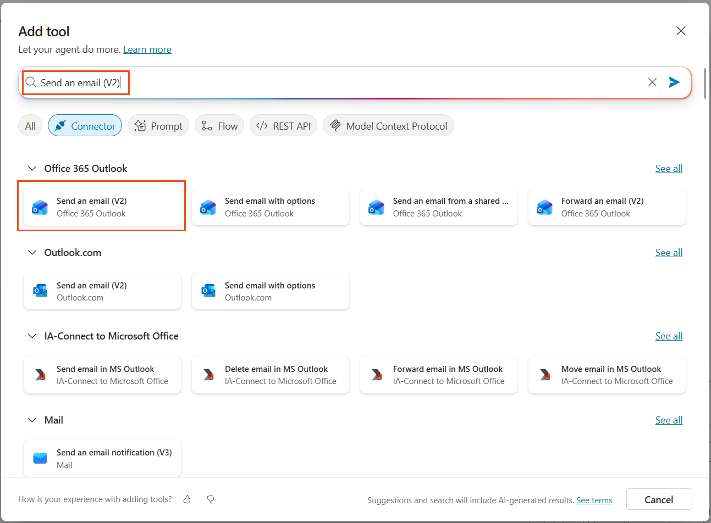

1. Wait for the connection to configure, and then select **Add and configure**

1. Configure the tool settings:

   - **Name**: Acknowledge SharePoint ticket
   - **Description**: This tool sends an email acknowledgement that a ticket has been received.

1. Select **Customize** next to the input parameters and configure as follows:

    **To**:

    - **Fill using**: Custom value
    - **Value**: _Enter your work (Woodside) email address_

      To avoid emailing anyone else while testing, your email address has been hard-coded here. In a real-world scenario, you would likely configure this step to email the person who submitted the ticket.
      


    **Body**:

    - **Description**: An acknowledgement that the Ticket was received, and we aim to respond within 3 working days.

    


1. Select **Save**

### 10.4 Test the trigger

1. Inside your **Help Desk Agent**, select the **Overview** tab
1. Click **Test Trigger** icon next to the **New Support Ticket Created in SharePoint** trigger. This will load the **Test your trigger** window.
1. Open a new browser tab and navigate to your **Tickets-TrainingContent**, found in the site [Agent Academy Training Site](https://woodsideenergy.sharepoint.com/sites/AgentAcademyTrainingSite)
1. Click **+ Add new item** to create a test ticket:
   - **Title**: "Unable to connect to VPN"
   - **Description**: "Unable to connect to corporate WIFI network after recent update"
   - **Priority**: "Normal"

1. **Save** the SharePoint item.
   > [!WARNING]
   > Keep note of the time you saved the SharePoint item. In the next steps when testing the trigger, you will see any recent runs of the trigger, which may be by other users. Keeping note of the time will help with testing using your entry.**The SharePoint list "Tickets-TrainingContent" contains fictional data used for these exercises. It is shared across Woodside, which means you will see records created by other users. And anything you add to the SharePoint list will be visible by others too.**

    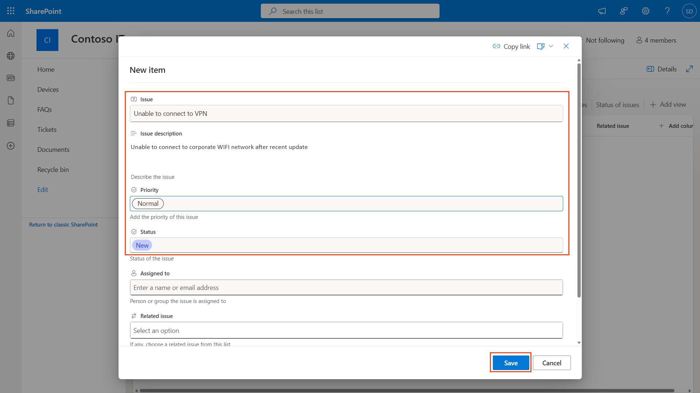
1. Return to **Copilot Studio** and monitor the **Test your trigger** panel for the trigger activation. Use the **Refresh** icon to load the trigger event, this may take a few minutes.  
    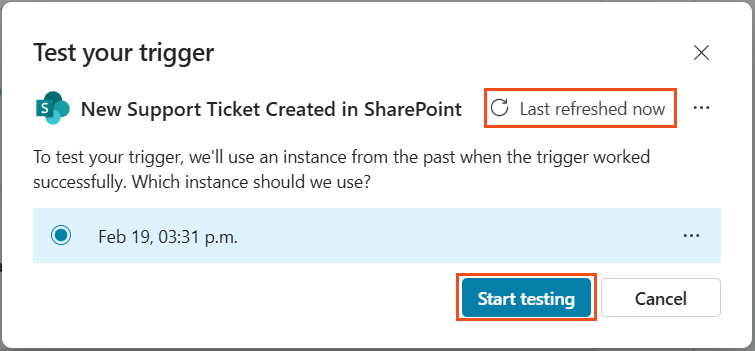
1. Once the trigger appears, select **Start testing**
1. The Activity Map panel will now show, and the agent will process the test event. When asked **Connect to continue**, select **Allow**  
    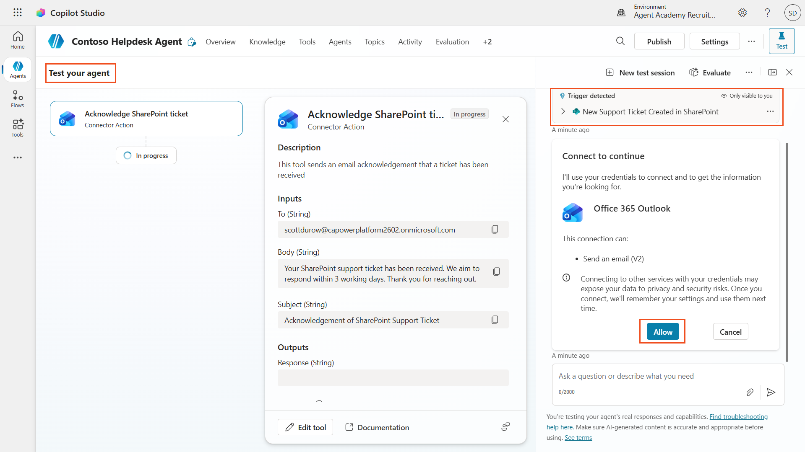
1. Verify that your agent:
   - Received the trigger payload
   - Called the "Acknowledge SharePoint ticket" tool  
     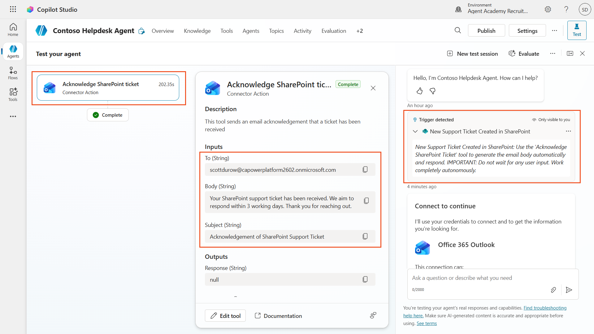
1. Check your email inbox to confirm the acknowledgment email was sent  
    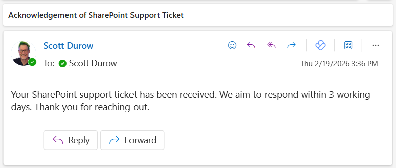
1. Review the **Activity** tab in Copilot Studio to see the complete trigger and tool execution

### 10.5 Disable Send Email action
After testing the agent, disable the email action to avoid accidental triggering as this is a training exercise. From the **Tools** area of your agent, switch the toggle for **Enabled** to **Off**. 


## ✅ Mission Complete {#mission-complete}

🎉 **Congratulations!** You've successfully implemented event triggers with connector tools that enable your agent to operate autonomously, automatically sending email acknowledgments and processing support tickets without user intervention. Once your agent is published, it will act autonomously on your behalf.

🚀 **Next up**: In our next lesson, you'll learn how to [publish your agent](../11-publish-your-agent/index.md) to Microsoft Teams and Microsoft 365 Copilot.

⏭️ [Move to **Publish your agent** lesson](../11-publish-your-agent/index.md)

## 📚 Tactical Resources {#tactical-resources}

Ready to dive deeper into event triggers and autonomous agents? Check out these resources:

- **Microsoft Learn**: [Make your agent autonomous in Copilot Studio](https://learn.microsoft.com/training/modules/autonomous-agents-online-workshop/?WT.mc_id=power-177340-scottdurow)
- **Documentation**: [Add an event trigger](https://learn.microsoft.com/microsoft-copilot-studio/authoring-trigger-event?WT.mc_id=power-177340-scottdurow)
- **Best Practices**: [Power Automate triggers introduction](https://learn.microsoft.com/power-automate/triggers-introduction?WT.mc_id=power-177340-scottdurow)
- **Advanced Scenarios**: [Using Power Automate flows with agents](https://learn.microsoft.com/microsoft-copilot-studio/advanced-flow-create?WT.mc_id=power-177340-scottdurow)
- **Security**: [Data loss prevention for Copilot Studio](https://learn.microsoft.com/microsoft-copilot-studio/admin-data-loss-prevention?WT.mc_id=power-177340-scottdurow)

<analytics-tag section="recruit" mission="10-add-event-triggers" />
