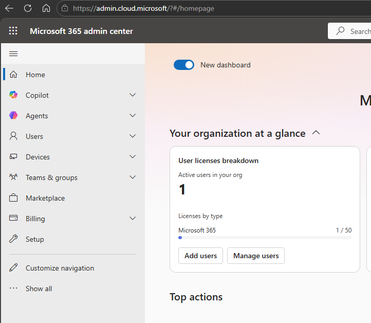
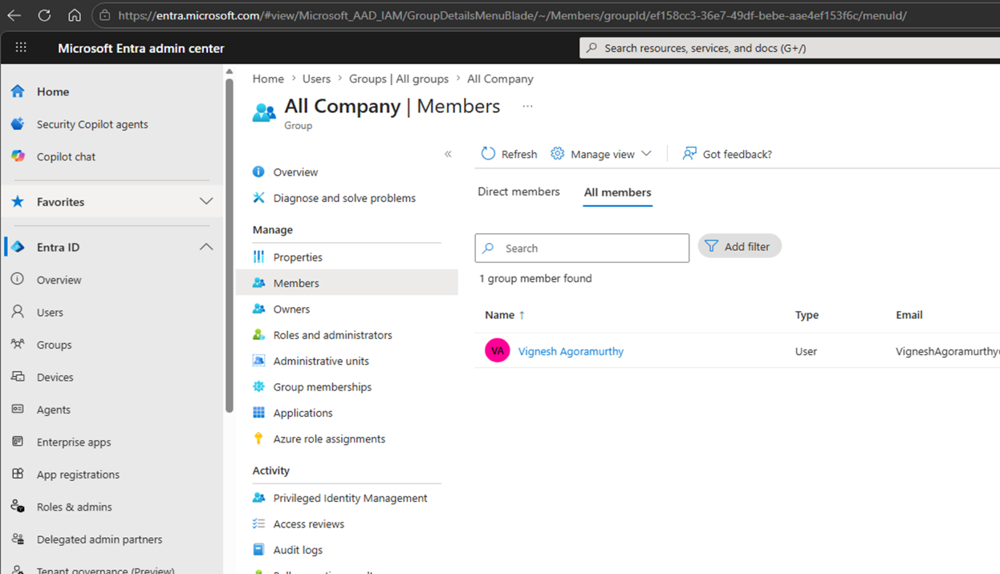
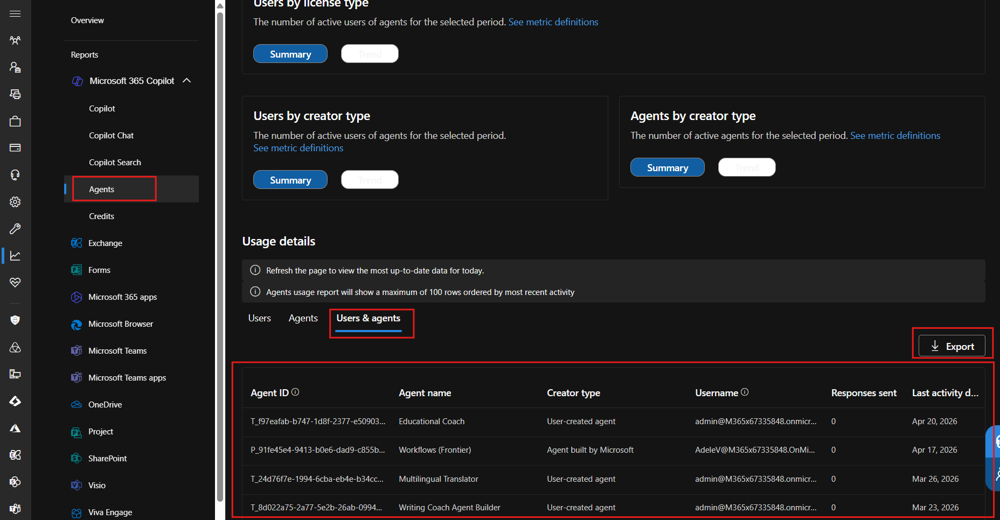
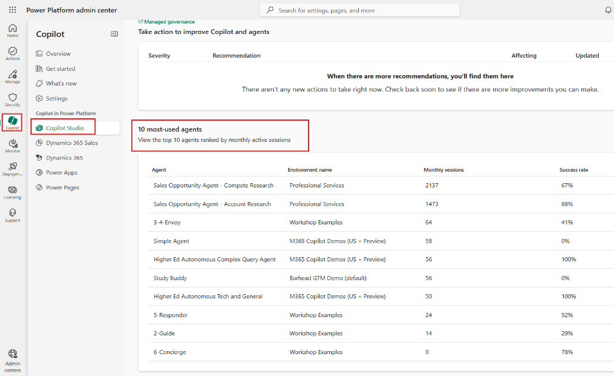
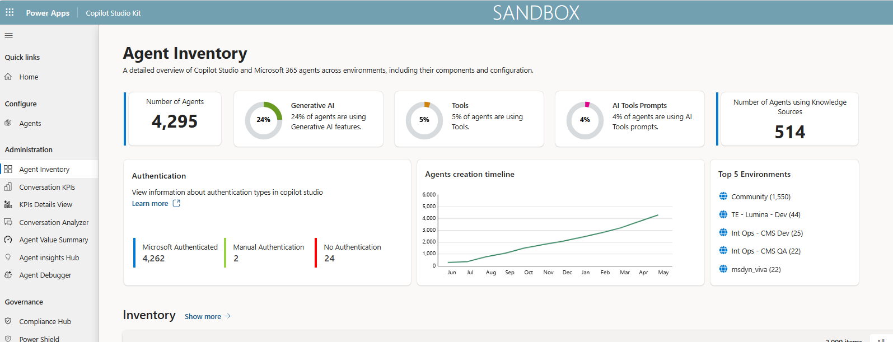
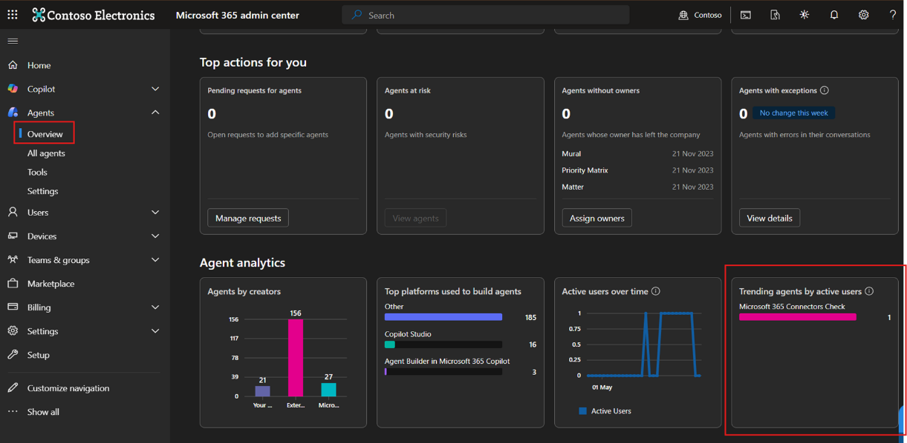
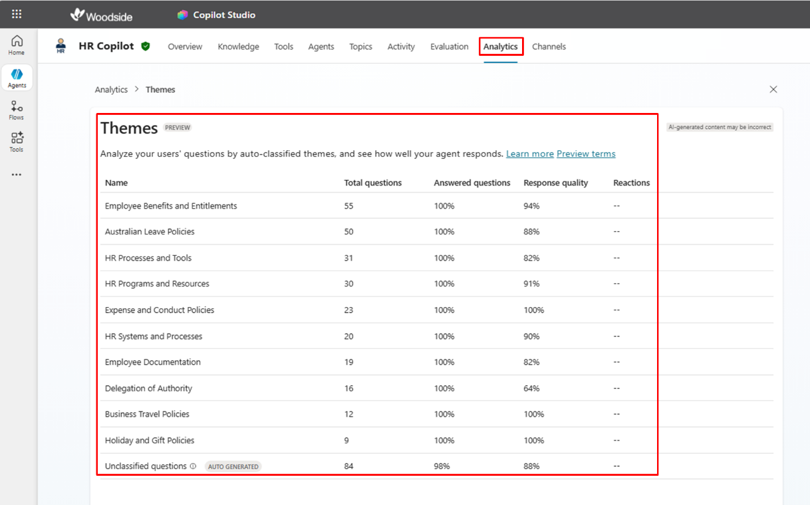

# Usage Metrics

## Users Enabled

#### Purpose

Tracks the total number of users enabled for Copilot Studio access.

This metric helps measure rollout scale, licensing exposure, and potential platform reach.

#### Data Sources

**Primary sources:**

-   Microsoft 365 Admin Centre
-   Entra Admin Centre
-   Microsoft 365 Admin Centre security group views

#### Out-of-the-box Availability

Yes

This metric is available through licensing, usage, or security group reporting, subject to access and tenant configuration.

#### How to access

**Option 1: Microsoft 365 Admin Centre**

1.  Go to Microsoft 365 Admin Centre.
2.  Navigate to **Reports**.
3.  Open **Usage**.
4.  Select the relevant Microsoft 365 Copilot or agent usage report.
5.  Review user licence, enabled user, or usage information where available.

    

**Option 2: Entra Admin Centre**

1.  Go to Entra Admin Centre.
2.  Navigate to the security groups used to manage Copilot Studio access.
3.  Review group membership.
4.  Validate whether users are enabled through assigned security groups.

#### How to interpret this metric

This metric represents the total number of users who have access to Copilot Studio, either through licensing, security group membership, or platform configuration.

#### Limitations

Licensing or enablement does not necessarily mean the user is actively using Copilot Studio.

Access should be validated against security groups where possible.

#### Required permissions

-   Global Reader
-   AI Administrator
-   Entra ID access, where security groups are used

Refer to the supporting walkthrough document for screenshots showing how to access this report or dashboard.

## Active Usage

#### Purpose

Measures the number of active users interacting with Copilot Studio agents over a defined period.

This metric helps assess whether users are actually using agents after enablement.

#### Data Sources

**Primary source:**

-   Microsoft 365 Admin Centre agent usage reports

#### Out-of-the-box Availability

Yes

Active agent user reporting is available through Microsoft 365 Admin Centre reporting, subject to licensing, permissions, and the types of agents included in the report.

#### How to access

1.  Go to Microsoft 365 Admin Centre.
2.  Navigate to **Reports**.
3.  Open **Usage**.
4.  Select **Microsoft 365 Copilot**.
5.  Select **Agents**.
6.  Review active user activity for the selected reporting period.

#### How to interpret this metric

This metric shows users who have actively interacted with agents, rather than users who only have access.

Microsoft's current agent usage report allows reporting across **7, 30, 90, or 180 days**.

#### Limitations

This metric should be interpreted carefully, as it may reflect agent usage in Microsoft 365 Copilot experiences rather than all possible Copilot Studio maker or administrative activity.

Microsoft currently notes that the report supports agents built through Copilot Studio or Teams Toolkit, including admin-approved agents, and that some agent types, such as SharePoint agents and Microsoft or partner-built agents, are not yet included.

## Usage Increase from a Baseline Date

#### Purpose

Measures growth in usage compared with a defined baseline date.

This metric helps track adoption momentum after rollout, enablement activity, training, or communications.

#### Data Sources

**Primary sources:**

-   Microsoft 365 Admin Centre
-   Power Platform Admin Centre
-   Custom dashboard or scheduled export

#### Out-of-the-box Availability

No

Usage data may be available out of the box, but the comparative metric --- usage increase from a baseline date --- generally requires additional analysis, export, or dashboarding.

#### How to access

**Option 1: Microsoft 365 Admin Centre**

1.  Go to Microsoft 365 Admin Centre.
2.  Navigate to **Reports**.
3.  Open **Usage**.
4.  Select **Microsoft 365 Copilot**.
5.  Select **Agents**.
6.  Compare usage across the available reporting periods.\
    

**Option 2: Power Platform Admin Centre**

1.  Go to Power Platform Admin Centre.
2.  Navigate to **Monitor**.
3.  Under **Products**, select **Copilot Studio**.
4.  Review Copilot Studio metrics and recommendations.

#### How to interpret this metric

This metric compares usage over time, such as before and after rollout, training, communications, or targeted enablement.

#### Limitations

Native reports may support time-period filtering, but they may not provide the exact baseline comparison or business-unit segmentation required for enterprise adoption reporting.

A custom dashboard, scheduled export, or reporting model may be required.

#### Additional configuration

Yes.

A custom dashboard or automated export process may be required to consistently track usage increase from a defined baseline.

Refer to the supporting walkthrough document for screenshots showing how to access this report or dashboard.

## Agents Created

#### Purpose

Tracks the total number of agents created across environments.

This metric helps measure platform growth and potential governance overhead.

#### Data Sources

**Primary source:**

-   Copilot Studio Kit

#### Out-of-the-box Availability

No

Agent inventory data is available through Copilot Studio Kit, but the kit must be installed and configured. Enterprise-wide reporting across environments may also require additional dashboarding.

#### How to access

1.  Open Copilot Studio Kit.
2.  Navigate to **Agent Inventory**.
3.  Review the list of agents created across available environments.
4.  Use reporting views or Power BI dashboards to aggregate agent counts.\
    

#### How to interpret this metric

This metric shows how many agents have been created, regardless of whether they are actively used.

#### Limitations

Copilot Studio Kit Agent Inventory is powered by the Agent Details table in Dataverse, which contains fields, source rules, versions, and descriptions used for downstream reporting.

A custom Power BI dashboard may be required to report across all environments or business units.

#### Additional configuration

Likely.

A custom dashboard may be required if reporting needs to include all environments, owners, business units, or lifecycle states.

Refer to the supporting walkthrough document for screenshots showing how to access this report or dashboard.

## Sessions

#### Purpose

Measures the total number of agent sessions initiated.

This metric helps assess platform activity and demand.

#### Data Sources

**Primary sources:**

-   Copilot Studio
-   Copilot Studio Kit

#### Out-of-the-box Availability

Yes

Session analytics are available through Copilot Studio analytics. Copilot Studio Kit can also support conversation KPI reporting where configured.

#### How to access

**Option 1: Copilot Studio**

1.  Open Copilot Studio.
2.  Select the relevant agent.
3.  Navigate to **Analytics**.
4.  Review session and conversation performance data.

**Option 2: Copilot Studio Kit**

1.  Open Copilot Studio Kit.
2.  Navigate to **Conversation KPIs**, where configured.
3.  Review conversation or session-level metrics.

#### How to interpret this metric

A session generally represents a user interaction with an agent during a defined conversation period.

#### Limitations

Session definitions should be applied consistently when comparing across agents or reporting periods.

Copilot Studio Kit Conversation KPI reporting may require additional setup. Microsoft's installation guidance notes that the embedded Conversation KPI dashboard requires configuration if it is used.

Refer to the supporting walkthrough document for screenshots showing how to access this report or dashboard.

## Active Agents

#### Purpose

Measures the number of agents actively used during a reporting period.

This metric helps distinguish operational agents from inactive, test, or abandoned agents.

#### Data Sources

**Potential sources:**

-   Microsoft 365 Admin Centre

#### Out-of-the-box Availability

Yes

The underlying usage and inventory data may be available, but the specific definition of "active agent" should be agreed and validated in the tenant.

#### How to access

**Recommended approach:**

1.  Identify all agents from Agent Inventory or Microsoft 365 Admin Centre.
2.  Compare against usage, sessions, or active user activity.
3.  Classify agents as active where they show usage within the reporting period.

#### How to interpret this metric

This metric identifies agents with measurable user interaction during the selected reporting window.

#### Limitations

This metric may require custom logic because an agent can exist without being actively used.

#### Additional configuration

Likely.

A clear definition of "active" should be agreed before reporting.

For example: An active agent is an agent with at least one session in the reporting period.

## Most Popular or Most Used Agents

#### Purpose

Identifies the agents with the highest usage or active user counts.

This metric helps identify high-value agents, adoption hotspots, and candidates for further investment.

#### Data Sources

**Primary sources:**

-   Microsoft 365 Admin Centre
-   Power Platform Admin Centre
-   Custom dashboard or export

#### Out-of-the-box Availability

No

Some usage views are available out of the box, but enterprise reporting may require additional analysis, exports, or dashboarding.

#### How to access

**Option 1: Microsoft 365 Admin Centre**

1.  Go to Microsoft 365 Admin Centre.
2.  Navigate to **Reports**.
3.  Open **Usage**.
4.  Select **Microsoft 365 Copilot**.
5.  Select **Agents**.
6.  Review agent usage and active user information.\
    

**Option 2: Power Platform Admin Centre**

1.  Go to Power Platform Admin Centre.
2.  Navigate to **Monitor**.
3.  Under **Products**, select **Copilot Studio**.
4.  Review Copilot Studio metrics.

#### How to interpret this metric

This metric shows which agents have the highest usage, typically based on active users, sessions, or other interaction measures.

#### Limitations

Native reporting may not provide all enterprise reporting cuts required, such as business unit, owner, environment, trend history, or detailed comparison against baselines.

Custom dashboards may be required for more mature reporting.

Refer to the supporting walkthrough document for screenshots showing how to access this report or dashboard.

## Who Is Using Them

#### Purpose

Identifies which users are interacting with Copilot Studio agents.

This metric helps understand adoption patterns and user engagement.

#### Data Sources

**Primary source:**

-   Microsoft 365 Admin Centre agent usage reporting

#### Out-of-the-box Availability

Yes

User-level usage reporting is available, subject to reporting permissions, privacy controls, tenant settings, and report scope.

#### How to access

1.  Go to Microsoft 365 Admin Centre.
2.  Navigate to **Reports**.
3.  Open **Usage**.
4.  Select **Microsoft 365 Copilot**.
5.  Select **Agents**.
6.  Review user and agent usage information.

#### How to interpret this metric

This metric shows which users have interacted with specific agents during the reporting period.

#### Limitations

User-level reporting may be subject to privacy settings, report scope, and data availability constraints.

The report should not be treated as a complete view of every possible agent interaction unless the tenant scope and included agent types are confirmed.

## What They Are Being Used For

#### Purpose

Identifies the themes, topics, or patterns users are asking agents about.

This metric helps understand how users are applying Copilot Studio and whether use aligns to intended scenarios.

#### Data Sources

**Primary source:**

-   Copilot Studio

#### Out-of-the-box Availability

Yes

Copilot Studio analytics provides insights into agent effectiveness and user interaction patterns. Availability and usefulness may vary depending on agent configuration and interaction volume.

#### How to access

1.  Open Copilot Studio.
2.  Select the relevant agent.
3.  Navigate to **Analytics**.
4.  Review themes, topics, unanswered questions, or other available insight areas.\
    

#### How to interpret this metric

Themes or interaction patterns help identify common question types, intents, or use cases.

#### Limitations

Low-volume agents may not show useful trend or theme data.

Topic analytics is available for agents in classic mode only, according to Microsoft's current topic analytics documentation.

Refer to the supporting walkthrough document for screenshots showing how to access this report or dashboard.
