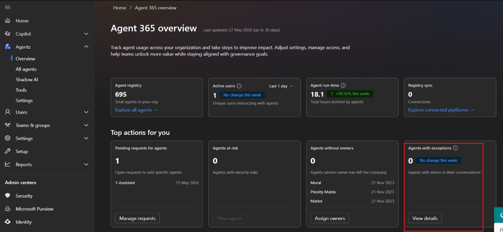
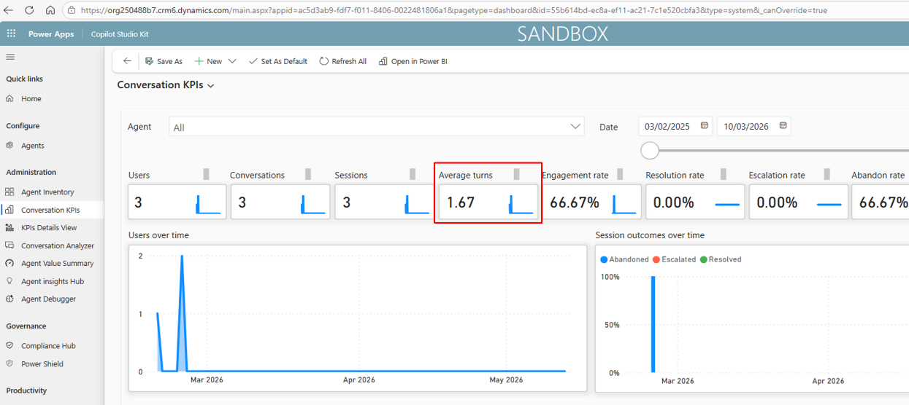
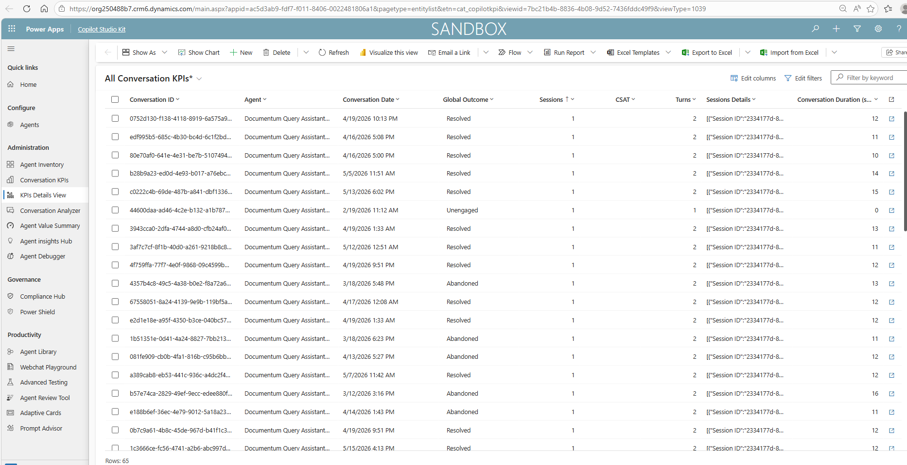

---
prev:
  text: 'Usage Metrics'
  link: '/observability/1-usage-metrics'
next:
  text: 'User Behaviour Metrics'
  link: '/observability/3-user-behaviour-metrics'
---

# Correct Usage Metrics

## Exceptions

### Purpose

Tracks exceptions or errors generated during interactions or workflows.
This metric helps identify operational failures, agent issues, and areas requiring remediation.

### Data Sources

**Primary source:**

- Microsoft 365 Admin Centre

### Out-of-the-box Availability

Yes
Exception or issue-related reporting may be available through Microsoft 365 Admin Centre agent management and reporting experiences, depending on tenant configuration and licensing.

### How to access

1. Go to Microsoft 365 Admin Centre.
1. Navigate to the relevant agent reporting or agent management area.
1. Review agents with exceptions, failures, or issue indicators where available.\
    

### How to interpret this metric

Exceptions indicate where agents may have encountered issues, such as failed workflows, errors, or operational problems.

### Limitations

Exception data should be reviewed with technical teams to confirm root cause.

## CSAT

### Purpose

Measures customer satisfaction or user satisfaction captured during interactions.
This metric helps assess perceived response quality and user experience.

### Data Sources

**Potential source:**

- Copilot Studio, where CSAT is configured

### Out-of-the-box Availability

No
CSAT is not consistently available for all agent types and may depend on configuration and orchestration model.

### How to access

**Recommended approach:**

1. Open Copilot Studio.
1. Select the relevant agent.
1. Navigate to analytics or satisfaction reporting.
1. Review available CSAT results, where configured.

### How to interpret this metric

CSAT reflects user feedback on the quality or usefulness of the agent interaction.

### Limitations

CSAT may not be available for all generative AI orchestrated agents.
Where satisfaction reporting is required, the agent design and configuration should be reviewed to confirm whether CSAT can be captured.

### Additional configuration

Yes.
CSAT may need to be explicitly configured at the agent level.

### Feasibility

Low for many generative AI orchestrated agents.

## Turns

### Purpose

Measures the number of conversational turns per interaction.
This metric helps understand interaction complexity and efficiency.

### Data Sources

**Primary sources:**

- Copilot Studio
- Copilot Studio Kit

### Out-of-the-box Availability

Yes
Turns are available through Copilot Studio analytics and/or Copilot Studio Kit Conversation KPI reporting, where configured.

### How to access

**Option 1: Copilot Studio**

1. Open Copilot Studio.
1. Select the relevant agent.
1. Navigate to **Analytics**.
1. Review session or conversation metrics.

**Option 2: Copilot Studio Kit**

1. Open Copilot Studio Kit.
1. Navigate to the **Conversation KPI** dashboard, where configured.
1. Review turn count by conversation or reporting period.\
    

### How to interpret this metric

A turn typically represents one exchange in the conversation, such as a user message or agent response.

### Limitations

High turn counts may indicate complex user needs, but they may also indicate inefficient conversation design.

Interpretation should consider agent purpose and use case.

## Conversation Duration

### Purpose

Measures the duration of Copilot Studio interactions.
This metric helps assess efficiency, user effort, and conversation complexity.

### Data Sources

**Primary sources:**

- Copilot Studio
- Copilot Studio Kit

### Out-of-the-box Availability

Yes
Conversation duration is available through Copilot Studio analytics and/or Copilot Studio Kit KPI views, where configured.

### How to access

**Option 1: Copilot Studio**

1. Open Copilot Studio.
1. Select the relevant agent.
1. Navigate to **Analytics**.
1. Review session or conversation duration.

    

**Option 2: Copilot Studio Kit**

1. Open Copilot Studio Kit.
1. Navigate to **Conversation KPIs** or relevant KPI views, where configured.
1. Review duration metrics.

### How to interpret this metric

Conversation duration shows how long users spend interacting with an agent.

### Limitations

Longer duration is not always negative.
For complex use cases, longer interactions may be expected. Interpretation should be linked to the agent's intended purpose.
