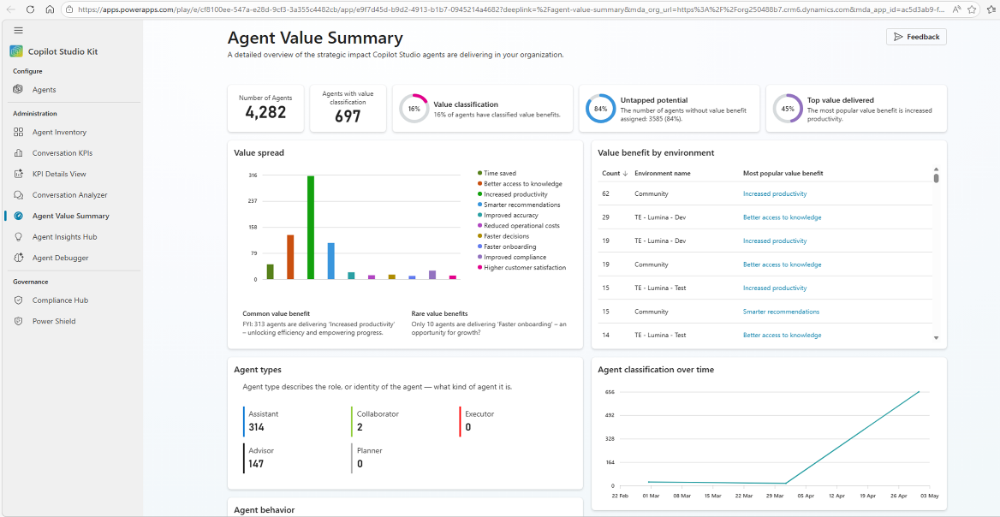
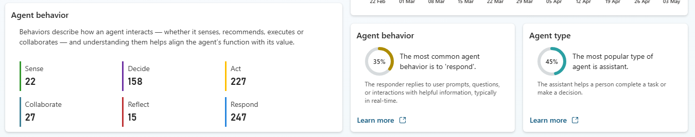
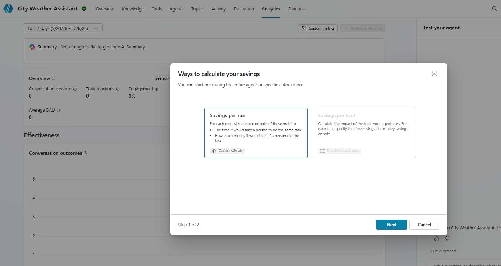
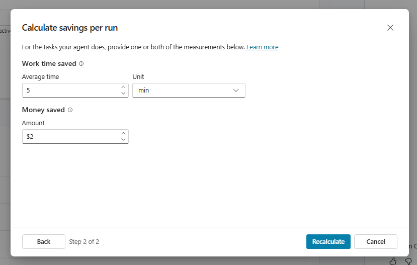
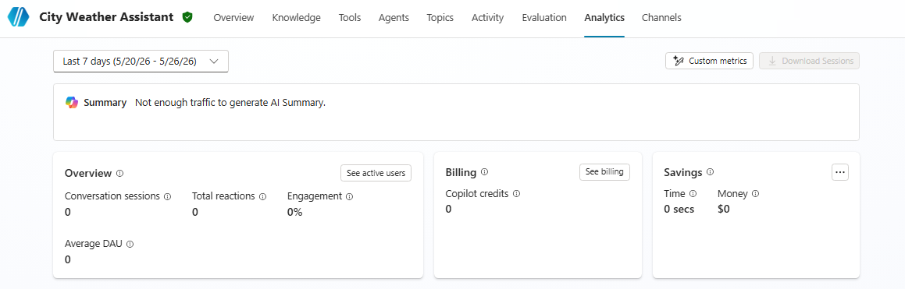
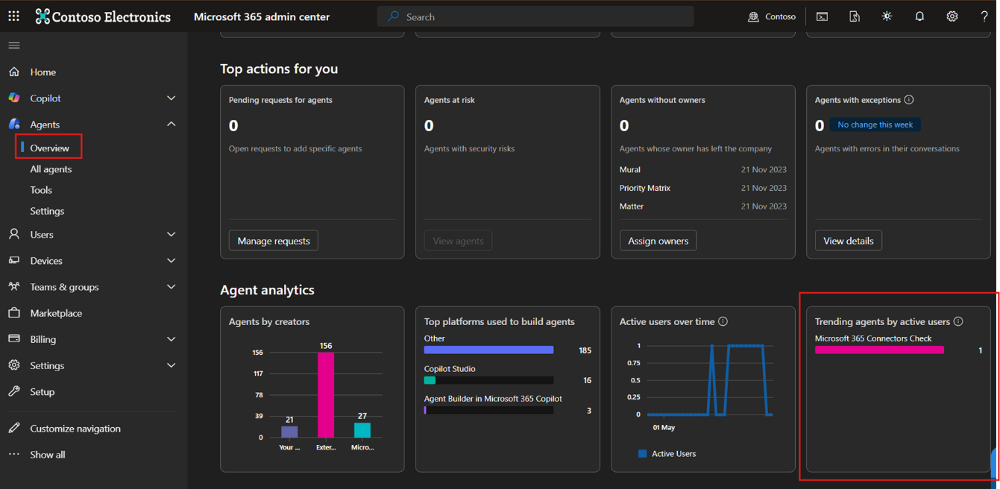
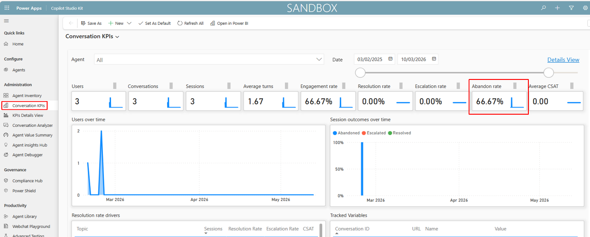

---
prev:
  text: 'Correct Usage Metrics'
  link: '/observability/2-correct-usage-metrics'
next:
  text: 'Compliance Metrics'
  link: '/observability/4-compliance-metrics'
---

# User Behaviour Metrics

## Time Saved

### Purpose

Estimates time savings generated through Copilot Studio interactions.
This metric supports productivity and efficiency reporting.

### Data Sources

**Primary sources:**

- Copilot Studio Kit
- Copilot Studio

### Out-of-the-box Availability

Yes
Time saved can be surfaced through Copilot Studio Kit Agent Value reporting or Copilot Studio savings configuration, where configured.

### How to access

#### Option 1: Copilot Studio Kit

1. Open Copilot Studio Kit.
1. Navigate to **Agent Value** or **Agent Value Summary**.
1. Review AI prompt-driven or agent-level time savings.

#### Option 2: Copilot Studio

1. Open Copilot Studio.
1. Navigate to the relevant agent.
1. Review savings where configured by the maker.

### How to interpret this metric

Time saved represents an estimate of the time users may have saved by using the agent instead of completing the task manually.

### Limitations

This is an estimated value and should not be treated as a precise operational measure unless calculation assumptions are documented.

Microsoft's Copilot Studio Kit guidance includes Agent Value dashboarding to support value measurement, including classification of conversational and autonomous agents.

### Additional configuration

May be required.
The value depends on whether makers or administrators have configured savings assumptions.

## Money Saved

### Purpose

Estimates cost savings generated through Copilot Studio interactions.
This metric supports ROI and business value reporting.

### Data Sources

**Primary sources:**

- Copilot Studio Kit
- Copilot Studio

### Out-of-the-box Availability

Yes
Money saved can be surfaced where savings assumptions are configured in Copilot Studio or through Copilot Studio Kit value reporting.

### How to access

#### Option 1: Copilot Studio Kit

1. Open Copilot Studio Kit.
1. Navigate to **Agent Value** or **Agent Value Summary**.
1. Review estimated value or cost savings.

    

    

#### Option 2: Copilot Studio

1. Open Copilot Studio.
1. Navigate to the relevant agent.
1. Review savings where configured.

    

    

    

### How to interpret this metric

Money saved is typically calculated from estimated time savings and cost assumptions.

### Limitations

This is an estimated metric and depends on the assumptions used.
For executive reporting, calculation logic should be documented.

### Additional configuration

May be required.
Savings assumptions may need to be configured and validated.

## Repeat Usage

### Purpose

Measures repeated user interactions over time.
This metric helps identify sustained adoption and user reliance.

### Data Sources

**Primary sources:**

- Microsoft 365 Admin Centre
- Custom dashboard or export

### Out-of-the-box Availability

**No**
Usage data may be available, but repeat usage as a reliable enterprise trend typically requires user-agent interaction analysis over time.

### How to access

1. Go to Microsoft 365 Admin Centre.
1. Navigate to **Reports**.
1. Open **Usage**.
1. Select **Microsoft 365 Copilot**.
1. Select **Agents**.
1. Review user and agent activity over the available reporting periods.

    

    

### How to interpret this metric

Repeat usage indicates whether users return to the same agent over time.
This is often a stronger adoption signal than one-off usage.

#### Limitations

Native reports may show usage over predefined periods, but may not directly calculate repeat usage in the way required for enterprise adoption reporting.
A custom dashboard or scheduled export may be required to measure repeat usage reliably over time.

## Abandoned Conversations

### Purpose

Tracks interactions that are terminated before achieving a meaningful outcome.
This metric helps identify usability issues, workflow gaps, or agent design problems.

### Data Sources

**Primary source:**

- Copilot Studio Kit

### Out-of-the-box Availability

Yes
Abandoned conversation reporting may be available through Copilot Studio Kit Conversation KPIs, where configured.

### How to access

1. Open Copilot Studio Kit.
1. Navigate to **Conversation KPIs**, where configured.
1. Review abandoned conversation metrics where available.
1. Validate results against agent configuration.\
    

### How to interpret this metric

Abandoned conversations may indicate that users left the interaction before completion.

### Limitations

For generative AI orchestrated agents, abandoned conversations may be difficult to identify accurately.
Conversation KPI outputs may not reflect the correct number unless agent-level configuration has been implemented.

### Additional configuration

Yes.
Agent-level configuration may be required for meaningful abandoned conversation reporting.

## Agent Adoption by Business Unit

### Purpose

Measures usage trends segmented by business area.
This metric helps identify adoption hotspots, gaps, and areas requiring further enablement.

### Data Sources

**Potential sources:**

- Copilot Studio Kit
- Dataverse
- Custom Power BI dashboard
- Environment-based reporting

### Out-of-the-box Availability

No
Business unit reporting generally requires environment, ownership, user, cost centre, or organisational mapping that is unlikely to exist in a complete form out of the box.

### How to access

**Recommended approach:**

1. Confirm whether each business unit has a dedicated Power Platform environment.
1. Open Copilot Studio Kit.
1. Review available agent and usage data by environment.
1. Use a custom Power BI dashboard to map environments or agents to business units.

### How to interpret this metric

This metric shows which business areas are creating or using Copilot Studio agents.

### Limitations

This metric depends heavily on environment design and governance structure.
If business units share environments, additional mapping may be required.

### Additional configuration

Yes.
A custom reporting model is likely required unless business units are already separated by environment.

### Feasibility

Medium.
