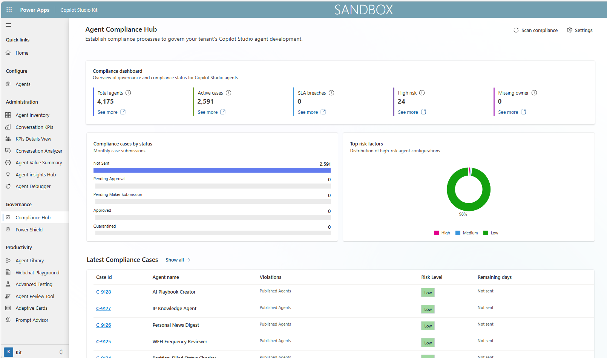
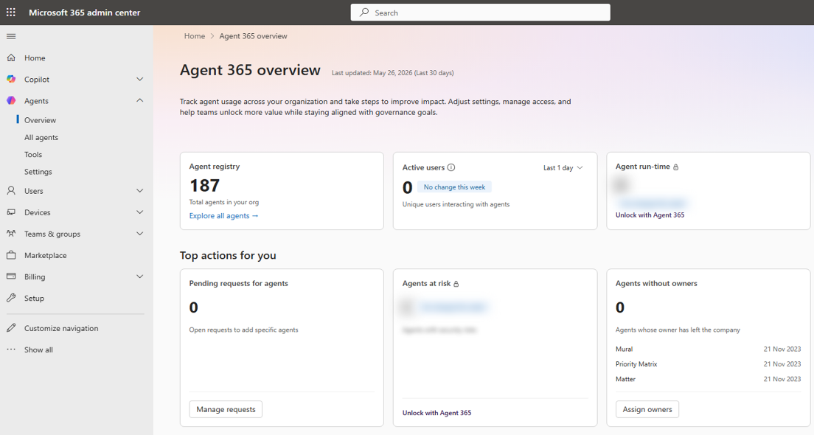
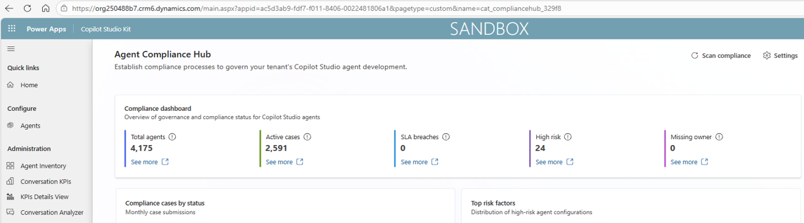
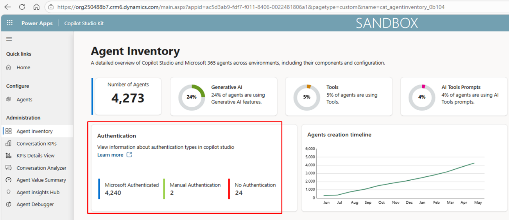
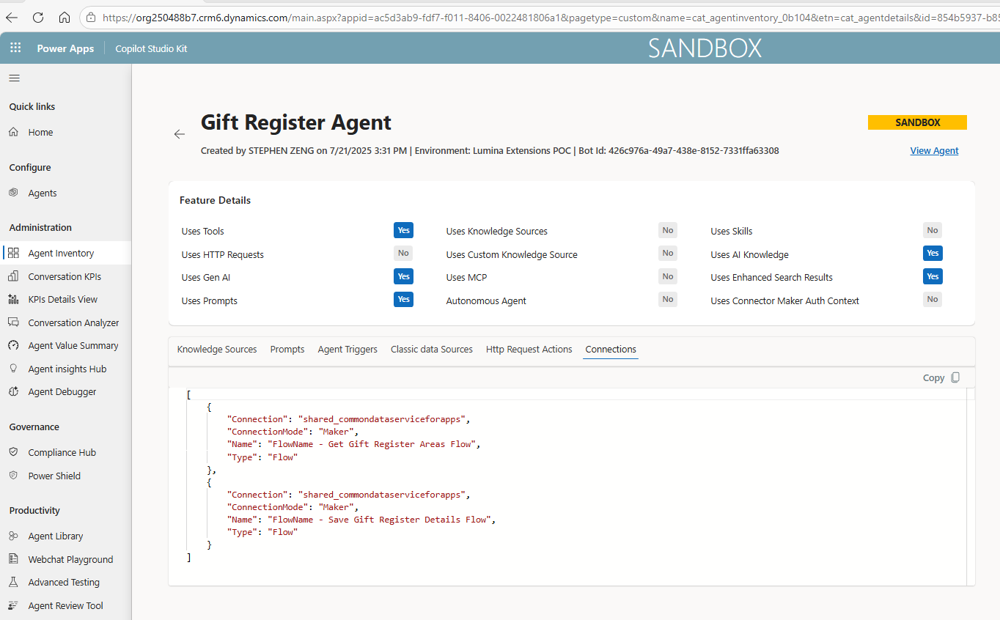
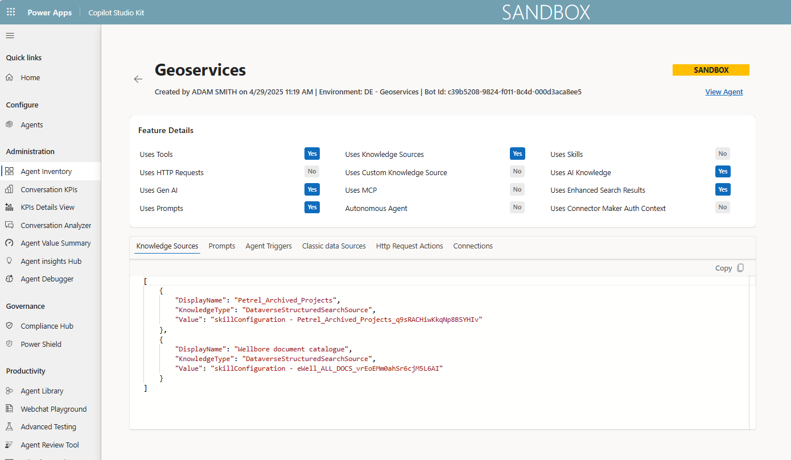
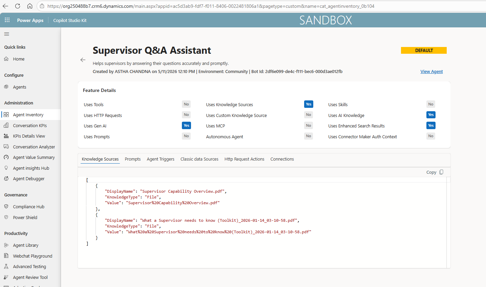
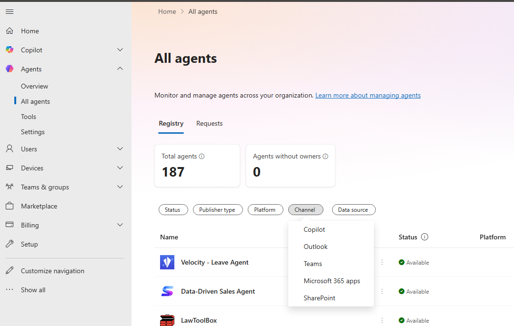

# Compliance Metrics

## Compliance Cases

#### Purpose

Tracks the total number and status of agents in breach of compliance policies.

This metric helps monitor governance compliance and platform risk.

#### Data Sources

**Primary source:**

-   Copilot Studio Kit

#### Out-of-the-box Availability

Yes

Compliance cases are available through Copilot Studio Kit Compliance Hub, where the kit and compliance policies are configured.

#### How to access

1.  Open Copilot Studio Kit.
2.  Navigate to **Compliance Hub**.
3.  Review compliance cases.
4.  Filter by status, policy type, owner, environment, or agent where available.\
    

#### How to interpret this metric

Compliance cases identify agents that may be breaching defined governance policies.

#### Limitations

This metric depends on the compliance policies configured in Copilot Studio Kit.

Microsoft guidance notes that Compliance Hub supports monitoring compliance status and managing cases, including dashboard KPIs such as total agents, open cases, and SLA breaches.

## Agents Without Owners

#### Purpose

Tracks the total number of agents without an assigned owner.

This metric helps ensure accountability and identify potentially abandoned or defunct agents.

#### Data Sources

**Primary sources:**

-   Microsoft 365 Admin Centre
-   Copilot Studio Kit

#### Out-of-the-box Availability

Yes

Agents without owners can be identified through Microsoft 365 Admin Centre agent management and/or Copilot Studio Kit, subject to configuration and permissions.

#### How to access

**Option 1: Microsoft 365 Admin Centre**

1.  Go to Microsoft 365 Admin Centre.
2.  Navigate to **Agents**.
3.  Open **All agents**.
4.  Review ownership information where available.\
    

**Option 2: Copilot Studio Kit**

1.  Open Copilot Studio Kit.
2.  Navigate to **Compliance Hub** or **Agent Inventory**.
3.  Review agents missing ownership information.\
    

#### How to interpret this metric

This metric identifies agents that do not have a clear accountable owner.

#### Limitations

Ownership information may depend on how agents are created, managed, or maintained.

Where ownership is missing, follow-up with the relevant environment or platform owner may be required.

Microsoft's current Agent Registry guidance uses the Microsoft 365 Admin Centre **Agents → All agents** experience for agent management.

## Authentication Type

#### Purpose

Tracks the number of agents by authentication method.

This metric helps manage risk by monitoring agents with no authentication, custom authentication, or other authentication configurations.

#### Data Sources

**Primary source:**

-   Copilot Studio Kit

#### Out-of-the-box Availability

Yes

Authentication type is available through Copilot Studio Kit Agent Inventory, where inventory has been configured.

#### How to access

1.  Open Copilot Studio Kit.
2.  Navigate to **Agent Inventory**.
3.  Review authentication type for each agent.
4.  Filter or group agents by authentication method.\
    

#### How to interpret this metric

Authentication type shows how users are authenticated when interacting with an agent.

#### Limitations

Authentication risk should be interpreted alongside the agent's purpose, audience, channel, and connected data sources.

## Connections

#### Purpose

Tracks the number and details of agent connections to data sources.

This metric helps monitor which systems, connectors, or services agents are connected to.

#### Data Sources

**Primary source:**

-   Copilot Studio Kit

#### Out-of-the-box Availability

**Yes**

Connection details are available through Copilot Studio Kit Agent Inventory, where inventory has been configured.

#### How to access

1.  Open Copilot Studio Kit.
2.  Navigate to **Agent Inventory**.
3.  Review connection details for each agent.
4.  Identify agents connected to sensitive or high-risk systems.

    

#### How to interpret this metric

Connections show which data sources or services an agent can access.

#### Limitations

Connection risk should be assessed based on both the connection type and the sensitivity of the connected data.

## AI Prompts Usage

#### Purpose

Tracks the number and details of AI prompts used by agents.

This metric helps monitor where agents are relying on AI prompts and supports governance of prompt-based functionality.

#### Data Sources

**Primary source:**

-   Copilot Studio Kit

#### Out-of-the-box Availability

Yes

AI prompt usage is available through Copilot Studio Kit Agent Inventory, where inventory has been configured.

#### How to access

1.  Open Copilot Studio Kit.
2.  Navigate to **Agent Inventory**.
3.  Review AI prompt usage by agent.
4.  Identify agents using AI prompts for further governance review where required.

    

#### How to interpret this metric

This metric identifies which agents use AI prompts as part of their configuration or behaviour.

#### Limitations

AI prompt usage should be reviewed in context, particularly for agents used in high-risk or sensitive business processes.

## Knowledge Sources

#### Purpose

Tracks the number and details of agent connections to knowledge sources.

This metric helps monitor which knowledge sources are being used in retrieval-augmented generation scenarios.

#### Data Sources

**Primary source:**

-   Copilot Studio Kit

#### Out-of-the-box Availability

**Yes**

Knowledge source details are available through Copilot Studio Kit Agent Inventory, where inventory has been configured.

#### How to access

1.  Open Copilot Studio Kit.
2.  Navigate to **Agent Inventory**.
3.  Review knowledge sources associated with each agent.
4.  Validate whether sources are appropriate, current, and approved.\
    

#### How to interpret this metric

Knowledge sources show which content repositories or data sources an agent may use to generate responses.

#### Limitations

Knowledge source reporting should be combined with content governance.

An approved connection does not guarantee that the underlying content is current, accurate, or appropriate.

## Channels

#### Purpose

Tracks the channels where each agent has been deployed, such as Teams or Microsoft 365.

This metric helps monitor how users can access agents.

#### Data Sources

**Primary source:**

-   Microsoft 365 Admin Centre

#### Out-of-the-box Availability

Yes

Channel information is available through Microsoft 365 Admin Centre agent management and registry views, subject to permissions and tenant availability.

#### How to access

1.  Go to Microsoft 365 Admin Centre.
2.  Navigate to **Agents**.
3.  Open **All agents**.
4.  Filter or review agents by availability, deployment, or channel information where available.\
    

#### How to interpret this metric

Channels indicate where an agent is available to users.

#### Limitations

Channel access should be reviewed alongside authentication type, audience, and connected data sources.

#### Required permissions

-   AI Administrator
-   Global Reader for view-only access

Microsoft notes that AI Admin and Global Reader roles can be used for agent management in the Microsoft 365 Admin Centre, with Global Reader providing view-only access.
